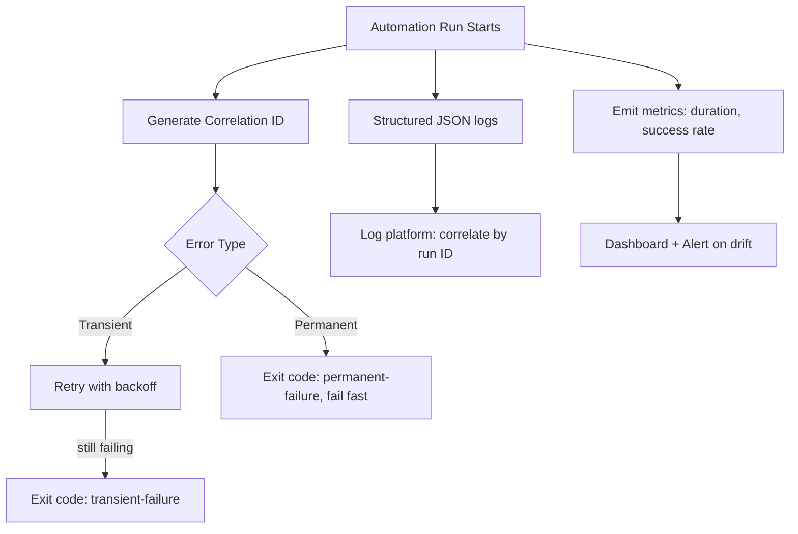

# Error Handling, Logging & Observability in Automation

**Level:** Advanced
**Tree:** [Enterprise Automation Practice](../README.md)
**Branch:** [Reliability, Observability & State](README.md)
**Forest:** [Automation & Scripting](../../../README.md)

## Explanation

# Error Handling, Logging, and Observability in Automation

A script that silently fails or produces ambiguous logs is worse than no automation at all, because it creates false confidence. Production-grade automation treats error handling as a first-class design concern, not an afterthought.

Key practices: distinguish **transient errors** (network blip, rate limit, temporary lock) from **permanent errors** (invalid input, missing permission, resource does not exist) and handle them differently — transient errors get retried with backoff, permanent errors fail fast with a clear message rather than retrying uselessly. Every automation should exit with a meaningful, distinct exit code per failure category, enabling calling systems (schedulers, CI) to react appropriately rather than treating every non-zero exit identically.

**Structured logging** (JSON with consistent fields: timestamp, run ID, resource, action, outcome) is essential once automation runs beyond a handful of scripts, because it enables aggregation, alerting, and correlation across a fleet of runs in a log platform (Splunk, ELK, Log Analytics) — plain text logs do not scale to fleet-wide troubleshooting. Every automation run should emit a unique **correlation/run ID** propagated through all downstream calls, so a single failure can be traced end-to-end across systems.

Observability goes beyond logs: automation should emit **metrics** (success rate, duration, resources affected) to a time-series system, enabling dashboards and alerting on drift (e.g. success rate dropping below 95% over a rolling window) rather than discovering failures only when someone happens to read a log file. Alerting on automation failures should route to the team that owns the automation, with enough context in the alert to triage without re-running the script manually first.

## Architecture and flow



## Commands

### Command 1

Trace every log entry for a specific automation run by correlation ID

```text
az monitor log-analytics query --workspace <id> --analytics-query "AutomationLogs | where RunId=='abc123' | order by TimeGenerated asc"
```

### Command 2

Publish a custom automation success-rate metric to CloudWatch for dashboarding and alerting

```text
aws cloudwatch put-metric-data --namespace Automation --metric-name RunSuccessRate --value 0.97
```

### Command 3

Alert on the success-rate metric rather than only publishing it - a metric nobody alerts on records a failure instead of surfacing it

```text
az monitor metrics alert create --name automation-failure-rate --resource-group <rg> --scopes <resourceId> --condition "avg RunSuccessRate < 0.95" --window-size 15m --evaluation-frequency 5m
```

### Command 4

Filter structured logs to the errors of one run, which only works if the automation emits JSON with a correlation id rather than free text

```text
aws logs filter-log-events --log-group-name /automation/runs --filter-pattern '{ $.level = "ERROR" && $.runId = "abc123" }'
```

### Command 5

List the runs that actually failed with their exception, which is the error-handling view the metric and log queries do not give you

```text
az automation job list --automation-account-name <acct> --resource-group <rg> --query "[?status=='Failed'].{Job:name,Started:startTime,Error:exception}" -o table
```

## Automation scripts

### structured_runner.py

```python
import json, logging, time, uuid, sys

logging.basicConfig(level=logging.INFO, format='%(message)s')
logger = logging.getLogger('automation')

def log_event(run_id, action, outcome, **kwargs):
    logger.info(json.dumps({
        'timestamp': time.time(), 'run_id': run_id,
        'action': action, 'outcome': outcome, **kwargs
    }))

def run_with_retry(fn, max_attempts=3, base_delay=2):
    run_id = str(uuid.uuid4())
    for attempt in range(1, max_attempts + 1):
        try:
            result = fn()
            log_event(run_id, fn.__name__, 'success', attempt=attempt)
            return result
        except TransientError as e:
            log_event(run_id, fn.__name__, 'transient_error', attempt=attempt, error=str(e))
            if attempt == max_attempts:
                sys.exit(2)
            time.sleep(base_delay ** attempt)
        except PermanentError as e:
            log_event(run_id, fn.__name__, 'permanent_error', error=str(e))
            sys.exit(1)

class TransientError(Exception): pass
class PermanentError(Exception): pass
```

## Lab

**Objective:** Instrument an existing automation script with structured logging, a correlation ID, retry-on-transient-error logic, and a success-rate metric.

### Steps

1. Add a unique run ID generated at the start of each script execution
2. Wrap all log statements in structured JSON with the run ID and action name
3. Classify at least two error types as transient (retry) and one as permanent (fail fast)
4. Emit a success/failure metric to a metrics backend after each run
5. Simulate a transient failure and confirm retry-with-backoff behavior, then simulate a permanent failure and confirm immediate fail-fast

### Validation

Every log line includes the run ID and can be filtered/correlated by it,Transient errors are retried with increasing backoff; permanent errors exit immediately without retry,A success-rate metric is visible in a dashboard after multiple runs

## Operational automation

Centralize the structured logging and retry pattern into a shared internal library so every new automation script inherits consistent correlation IDs, exit codes, and metrics emission without reimplementing it. Build an automated weekly report of automation success rates by owner team, flagging any automation below a success-rate threshold for review.

## Troubleshooting

### Scenario 1: On-call cannot tell why an automation run failed at 3am from the alert alone

**Likely cause:** Alert only contains a generic 'job failed' message without the run ID, error type, or affected resource

**Resolution:** Enrich alert payloads with the run ID, error classification, and a direct link to the correlated log query

### Scenario 2: Automation retries a permanent error repeatedly, wasting time and API quota

**Likely cause:** Error classification treats all exceptions as retryable instead of distinguishing permanent failures

**Resolution:** Explicitly classify exceptions (e.g. 404/permission errors as permanent, 429/timeout as transient) and fail fast on permanent ones

### Scenario 3: Logs are unusable for fleet-wide troubleshooting

**Likely cause:** Logs are unstructured free-text without consistent fields across scripts

**Resolution:** Standardize on structured JSON logging with a shared schema across all automation, ingested into a common log platform

## Interview questions

### 1. Why should transient and permanent errors be handled differently in automation?

Transient errors (rate limits, network blips) are worth retrying with backoff since they often resolve themselves, while permanent errors (missing permission, invalid input) will never succeed on retry, so retrying them wastes time and can mask the real problem; failing fast surfaces it immediately.

### 2. What does a correlation/run ID buy you that a timestamp alone does not?

A run ID lets you filter and reconstruct the complete sequence of events for one specific execution across every system and log source it touched, whereas timestamps alone cannot disambiguate concurrent or overlapping runs.

### 3. Why is structured logging important once automation scales beyond a few scripts?

Structured (e.g. JSON) logs with consistent fields can be aggregated, queried, and alerted on programmatically across an entire fleet of automation runs, while free-text logs require manual reading and do not scale to fleet-wide correlation or dashboards.

## Certification alignment

- AZ-400 - Implement monitoring and observability
- AWS DOP - Monitoring and logging

## References

- Google SRE Book: Chapter on monitoring distributed systems
- The Twelve-Factor App: Logs
- OpenTelemetry documentation

## Suggested video search

automation error handling structured logging observability retries

---

> Validate commands, versions, permissions, licensing, and rollback procedures in an isolated lab before production use.
