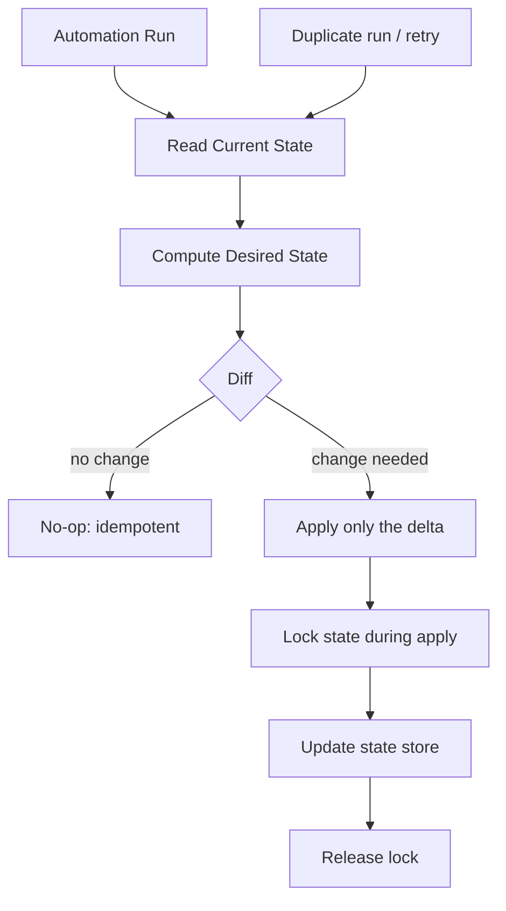

# Idempotency & State Management

**Level:** Advanced
**Tree:** [Enterprise Automation Practice](../README.md)
**Branch:** [Reliability, Observability & State](README.md)
**Forest:** [Automation & Scripting](../../../README.md)

## Explanation

# Idempotency and State Management in Automation

An automation is **idempotent** if running it multiple times with the same input produces the same end state as running it once, with no harmful side effects from repetition. This matters enormously because automation *will* be re-run — after a partial failure, a network timeout with an ambiguous result, a scheduler retry, or simple operator re-execution — and non-idempotent automation causes duplicate resources, double-charges, or corrupted state on re-run.

The standard technique is **desired-state reconciliation**: instead of scripting imperative steps ('create the VM', 'add the DNS record'), declare the desired end state and have the automation compute and apply only the delta needed to reach it (this is exactly what Terraform's plan/apply and Kubernetes controllers do). Where imperative actions are unavoidable (e.g. calling a one-shot API), use **idempotency keys** — a unique, deterministic identifier for the operation passed to the API so a duplicate call with the same key is recognized and safely ignored rather than executed twice.

State must be stored somewhere durable and lockable: Terraform state in a remote backend with locking (Azure Storage + blob lease, S3 + DynamoDB lock table) prevents two concurrent runs from corrupting the same state file. Automation that manages its own state (not backed by a mature tool) needs the same discipline: a durable store, optimistic or pessimistic locking, and a clear reconciliation step that compares actual observed state against desired state before acting, rather than blindly re-executing actions.

A frequent failure mode is 'check-then-act' race conditions — checking if a resource exists, then creating it, with a gap where a concurrent run creates it first. Idempotent creation (create-or-update / upsert semantics) avoids this entirely rather than trying to prevent the race with checks.

## Architecture and flow



## Commands

### Command 1

Apply Terraform changes with state locking enabled, preventing concurrent runs from corrupting state

```text
terraform apply -lock=true -lock-timeout=5m
```

### Command 2

Create a DynamoDB table to back Terraform's S3 remote state locking

```text
aws dynamodb create-table --table-name terraform-locks --attribute-definitions AttributeName=LockID,AttributeType=S --key-schema AttributeName=LockID,KeyType=HASH --billing-mode PAY_PER_REQUEST
```

### Command 3

Apply a Kubernetes manifest using server-side apply, which reconciles state idempotently by field ownership

```text
kubectl apply --server-side --field-manager=my-automation -f manifest.yaml
```

## Automation scripts

### idempotent_upsert.py

```python
import hashlib

def idempotency_key(operation: str, resource_id: str, payload: dict) -> str:
    raw = f"{operation}:{resource_id}:{sorted(payload.items())}"
    return hashlib.sha256(raw.encode()).hexdigest()

def upsert_resource(client, resource_id, desired_config):
    existing = client.get(resource_id)
    if existing is None:
        key = idempotency_key('create', resource_id, desired_config)
        return client.create(resource_id, desired_config, idempotency_key=key)
    if existing != desired_config:
        key = idempotency_key('update', resource_id, desired_config)
        return client.update(resource_id, desired_config, idempotency_key=key)
    return existing  # already at desired state: no-op
```

## Lab

**Objective:** Convert an imperative create-only script into an idempotent upsert with a locked remote state backend, and prove safe re-execution.

### Steps

1. Take a script that unconditionally creates a resource and refactor it to check current state first
2. Implement upsert logic: create if missing, update only if the desired config differs, no-op if it matches
3. Configure a remote state backend with locking for any tool-managed state (e.g. Terraform S3+DynamoDB)
4. Run the script twice in a row and confirm the second run makes no changes
5. Simulate two concurrent runs and confirm the lock prevents simultaneous state modification

### Validation

Second identical run produces zero changes (verified via plan/diff output or an audit log),Concurrent run attempt is blocked or queued by the state lock rather than corrupting state,Resource converges to desired state whether run zero, one, or five times

## Operational automation

Standardize on tools with built-in reconciliation (Terraform, Kubernetes controllers, Ansible's idempotent modules) rather than hand-rolled imperative scripts wherever possible. For custom automation that must call one-shot APIs, build idempotency-key generation into a shared library so every script gets safe-retry semantics by default rather than each author reinventing it inconsistently.

## Troubleshooting

### Scenario 1: Re-running a failed automation job creates duplicate resources

**Likely cause:** Script unconditionally creates without checking existing state or using an idempotency key

**Resolution:** Refactor to upsert semantics: check for existing state first, or pass a deterministic idempotency key the API can deduplicate on

### Scenario 2: Two pipeline runs triggered close together corrupt the Terraform state file

**Likely cause:** No state locking configured, or lock timeout too short for the operation duration

**Resolution:** Configure a remote backend with locking (S3+DynamoDB, Azure Storage blob lease) and set an adequate lock timeout

### Scenario 3: Automation behaves differently on retry after a partial failure

**Likely cause:** Script performs a sequence of non-idempotent imperative steps rather than reconciling to a desired end state

**Resolution:** Redesign as desired-state reconciliation so any retry recomputes the delta from actual to desired state rather than blindly repeating steps

## Interview questions

### 1. What makes an automation script idempotent, and why does it matter operationally?

Running it multiple times with the same input yields the same end state with no harmful side effects, which matters because retries, scheduler re-runs, and operator re-execution are inevitable in production, and non-idempotent scripts cause duplicated or corrupted resources when that happens.

### 2. How do idempotency keys solve the problem that desired-state reconciliation alone cannot?

For one-shot imperative API calls that are not naturally reconciled against a stored desired state, an idempotency key lets the API recognize and deduplicate a retried request with the same key, safely ignoring the duplicate rather than executing the action twice.

### 3. Why is state locking necessary even for idempotent automation?

Idempotency guarantees the same end result from repeated runs, but concurrent simultaneous runs can still race and corrupt a shared state file mid-write; locking serializes access so only one run mutates state at a time.

## Certification alignment

- Terraform Associate - State management and locking
- AZ-400 - Implement infrastructure as code

## References

- Terraform documentation: State locking
- Kubernetes documentation: Server-Side Apply
- Stripe API documentation: Idempotent requests

## Suggested video search

idempotency automation desired state reconciliation terraform locking

---

> Validate commands, versions, permissions, licensing, and rollback procedures in an isolated lab before production use.
