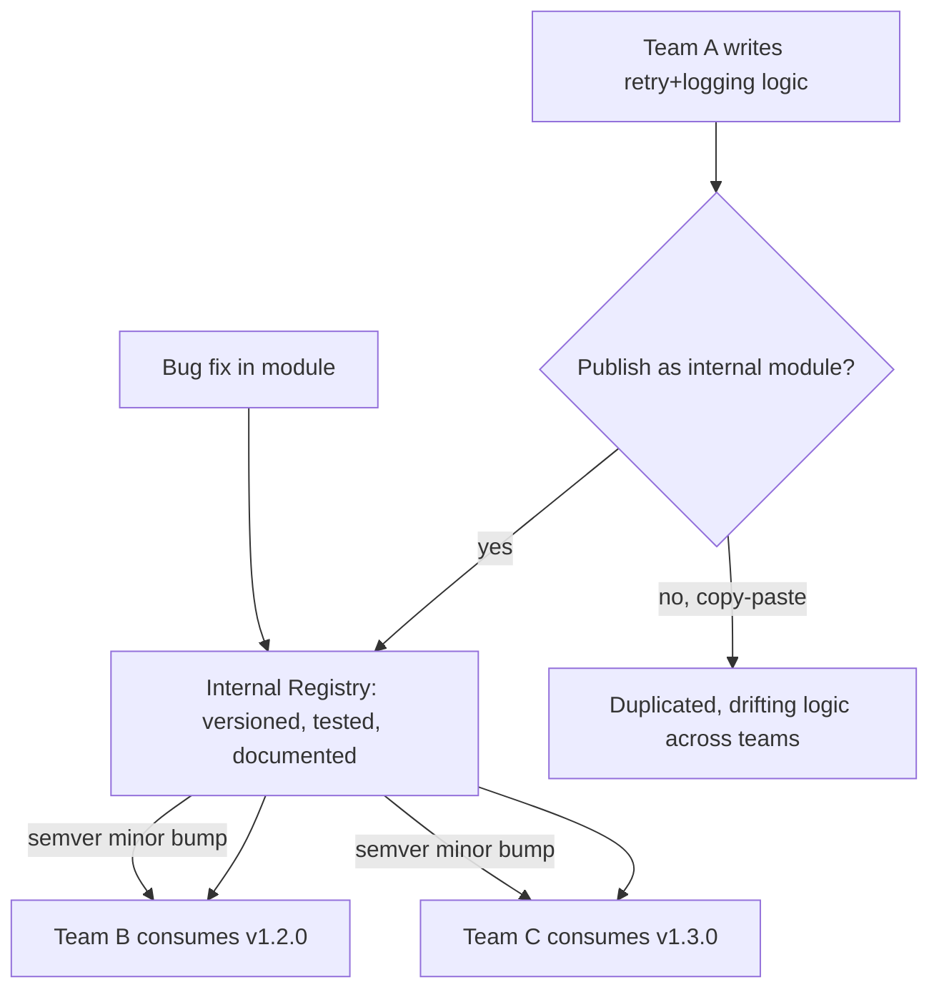

# Reusable Modules, Collections & Internal Tooling

**Level:** Intermediate
**Tree:** [Enterprise Automation Practice](../README.md)
**Branch:** [Secrets Handling & Reusable Tooling](README.md)
**Forest:** [Automation & Scripting](../../../README.md)

## Explanation

# Reusable Modules, Collections, and Internal Tooling

As automation scales beyond a handful of scripts, unmanaged duplication becomes the dominant maintenance cost: the same logic (retry handling, logging, a common API call) copy-pasted across dozens of scripts means every bug fix or requirement change must be repeated everywhere it was copied, and inevitably some copies are missed.

The fix is building **internal reusable libraries**: Terraform/OpenTofu modules for infrastructure patterns, Ansible roles/collections for configuration tasks, shared PowerShell/Python packages for common operational logic, all versioned and published to an internal registry (private Terraform registry, internal PyPI/npm feed, Ansible Galaxy/Automation Hub namespace) rather than copy-pasted or vendored inline.

Good internal modules have a clear, minimal, documented interface (inputs/outputs), sensible defaults so common cases require little configuration, semantic versioning so consumers can upgrade deliberately, and automated tests validating the module's behavior independent of any specific consumer. A module that is undocumented or has an unstable interface will be avoided in favor of copy-paste, defeating the purpose.

Governance matters as much as the tooling: a small platform/tooling team should own the core shared modules, with a clear contribution process for other teams to propose additions, and a deprecation policy for old module versions so the ecosystem does not silently fragment into dozens of unmaintained forks. Treating internal tooling with the same rigor as a public open-source project — README, changelog, issue tracker, code owners — is what makes it actually get reused rather than reinvented per team.

## Architecture and flow



## Commands

### Command 1

Fetch the latest allowed version of a Terraform module from an internal module registry

```text
terraform init && terraform get -update
```

### Command 2

Install a versioned internal Ansible collection published to a private Automation Hub

```text
ansible-galaxy collection install my_org.platform_ops --force
```

### Command 3

Publish a shared internal Node/Python tooling package to a private package registry

```text
npm publish --registry https://internal-npm.mycompany.com
```

## Automation scripts

### modules/retry-lib/versions.tf

```hcl
terraform {
  required_version = ">= 1.5.0"
}

variable "module_version" {
  description = "Pinned semantic version of this module consumers must reference explicitly"
  type        = string
  default     = "2.1.0"
}

output "module_metadata" {
  value = {
    name    = "platform/retry-lib"
    version = var.module_version
    owner   = "platform-engineering@company.com"
  }
}
```

## Lab

**Objective:** Extract duplicated logic from at least two existing scripts into a single versioned, documented internal module and migrate both consumers to it.

### Steps

1. Identify logic duplicated across two or more automation scripts (e.g. retry handling, a common API wrapper)
2. Extract it into a standalone module/package with a documented input/output interface
3. Add automated tests for the module independent of any specific consumer script
4. Publish it to an internal registry with a semantic version tag
5. Migrate both original scripts to consume the shared module and delete the duplicated inline logic

### Validation

Module has its own test suite passing independently of any consumer,Both original scripts now reference the published module instead of inline duplicated code,Module has a README documenting inputs, outputs, and versioning policy

## Operational automation

Set up CI for the internal module repository itself: automated tests, semantic-release versioning on merge to main, and automatic publishing to the internal registry, so module updates ship as reliably as any product code. Build a dependency-scanning job that reports which consumers are on outdated module versions, to drive proactive upgrade campaigns rather than discovering incompatibilities during an incident.

## Troubleshooting

### Scenario 1: Teams keep copy-pasting logic instead of using the shared module

**Likely cause:** Module is undocumented, has an unstable/breaking interface across versions, or is hard to discover

**Resolution:** Invest in documentation, semantic versioning discipline, and a discoverable internal catalog entry so the module is easier to adopt than to copy

### Scenario 2: A module update breaks multiple consuming teams simultaneously

**Likely cause:** Breaking change was released as a patch/minor version instead of a major version bump, or without a deprecation notice

**Resolution:** Enforce semantic versioning strictly, communicate breaking changes as major versions with migration notes, and support the previous major version during a deprecation window

### Scenario 3: No one knows who owns a widely-used internal module anymore

**Likely cause:** Module was created ad hoc without a designated owning team or code owners file

**Resolution:** Assign clear ownership via a CODEOWNERS file and a platform/tooling team charter, with a documented contribution and support process

## Interview questions

### 1. What is the main hidden cost of copy-pasting automation logic across scripts instead of building a shared module?

Every bug fix or requirement change must be manually reapplied to every copy, and it is easy to miss some copies, leading to silently diverging, inconsistent behavior across the fleet over time, which is far more expensive than the upfront cost of extracting a shared module.

### 2. Why does semantic versioning matter for internal modules specifically?

It lets consuming teams upgrade deliberately and safely, taking patch/minor updates with confidence while treating major version bumps as a signal to review migration notes, preventing an update from silently introducing a breaking change into unrelated teams' pipelines.

### 3. What makes an internal module actually get reused instead of being ignored in favor of copy-paste?

A clear, minimal, documented interface, sensible defaults, independent automated tests, and treating it with open-source-level rigor (README, changelog, ownership) so it is genuinely easier and more trustworthy to consume than to reimplement inline.

## Certification alignment

- Terraform Associate - Modules
- AZ-400 - Reusable infrastructure and pipeline templates

## References

- Terraform documentation: Module composition and versioning
- Ansible documentation: Collections
- Google Engineering Practices: readability and code review culture (applied internally to tooling)

## Suggested video search

internal developer tooling reusable terraform modules ansible collections versioning

---

> Validate commands, versions, permissions, licensing, and rollback procedures in an isolated lab before production use.
