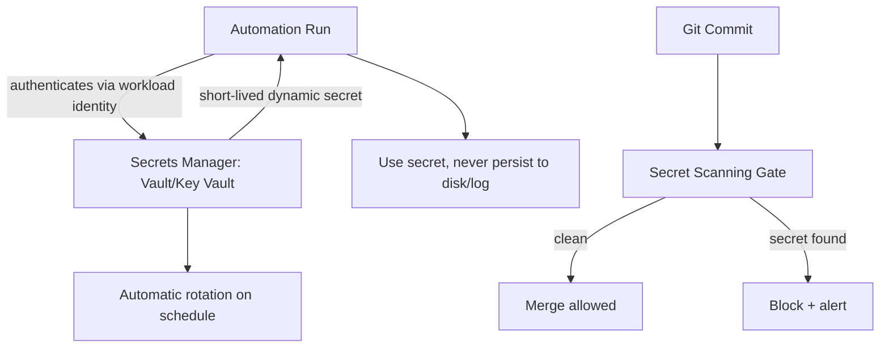

# Secrets Handling in Automation

**Level:** Advanced
**Tree:** [Enterprise Automation Practice](../README.md)
**Branch:** [Secrets Handling & Reusable Tooling](README.md)
**Forest:** [Automation & Scripting](../../../README.md)

## Explanation

# Secrets Handling in Automation

Automation frequently needs credentials — API tokens, database passwords, cloud keys — and how those secrets are obtained and used is one of the highest-risk areas of any automation practice. The foundational rule: **secrets never live in source code, plain-text config files, or shell history**, including 'temporarily' during development.

The preferred pattern is **dynamic, short-lived secrets** fetched at runtime from a secrets manager (Azure Key Vault, AWS Secrets Manager, HashiCorp Vault) using the automation's own **workload identity** (managed identity, IAM role, Vault AppRole) to authenticate to the secrets manager — so there is no static credential needed just to fetch other credentials. Vault can even generate database credentials on-demand with a short TTL, so a leaked credential expires quickly and there is no standing secret to steal.

When static secrets are unavoidable, they must be injected at runtime (environment variable populated by the orchestrator, mounted secret volume in Kubernetes, CI/CD masked pipeline variable) and never baked into container images or committed to git. **Secret scanning** (gitleaks, truffleHog, native GitHub/GitLab secret scanning) should run on every commit and every pipeline execution as a hard gate, catching accidental commits before they reach a shared history that is expensive to fully purge.

Rotation must be automatic and routine, not a manual fire-drill after a suspected leak — secrets with an indefinite lifetime are a standing liability regardless of how carefully they are stored. Logging must be secret-aware: automation frameworks should redact known secret patterns from logs by default, since a leaked log is just as damaging as a leaked config file.

## Architecture and flow



## Commands

### Command 1

Request a dynamic, short-lived database credential from HashiCorp Vault at runtime

```text
vault read database/creds/readonly-role
```

### Command 2

Retrieve a secret from Azure Key Vault at runtime using the caller's managed identity

```text
az keyvault secret show --vault-name myvault --name db-password --query value -o tsv
```

### Command 3

Scan a repository for committed secrets and fail if any are found, for use as a CI gate

```text
gitleaks detect --source . --exit-code 1
```

## Automation scripts

### fetch-secret-runtime.sh

```bash
#!/usr/bin/env bash
set -euo pipefail
# Fetch a short-lived DB credential using the workload's own managed identity - no static secret required
DB_PASSWORD=$(az keyvault secret show \
  --vault-name "$KEYVAULT_NAME" \
  --name "db-runtime-password" \
  --query value -o tsv)

export PGPASSWORD="$DB_PASSWORD"
psql -h "$DB_HOST" -U "$DB_USER" -c "SELECT 1;" > /dev/null
unset PGPASSWORD DB_PASSWORD
echo 'Connectivity check passed without persisting the secret to disk'
```

## Lab

**Objective:** Replace a hard-coded credential in a script with a runtime fetch from a secrets manager using workload identity, and add a secret-scanning gate.

### Steps

1. Identify a script with a hard-coded or environment-baked static secret
2. Store the secret in a secrets manager (Key Vault, Secrets Manager, or Vault)
3. Grant the automation's identity (managed identity/IAM role) read access to only that secret
4. Refactor the script to fetch the secret at runtime and never write it to disk or logs
5. Add gitleaks (or equivalent) as a pre-commit hook and a CI gate, and verify it blocks a deliberately committed test secret

### Validation

No static secret remains in code, config files, or container image layers,Automation successfully authenticates to the secrets manager using workload identity, not a stored key,Secret scanning gate blocks a commit containing a test secret pattern

## Operational automation

Configure Vault or Key Vault to issue dynamic, short-TTL credentials for databases and internal APIs wherever the backend supports it, eliminating standing secrets entirely for those integrations. Add secret scanning as a mandatory pre-commit hook and a blocking CI stage repo-wide, and schedule automatic rotation for any secret that must remain static, with alerting if a secret approaches its maximum age without rotation.

## Troubleshooting

### Scenario 1: A secret was accidentally committed to git history

**Likely cause:** No pre-commit secret scanning gate, or the gate was bypassed

**Resolution:** Immediately rotate/revoke the leaked secret (git history removal alone is not sufficient since it may already be cloned/cached), then enforce secret scanning as a non-bypassable gate

### Scenario 2: Automation fails intermittently right after a secret rotation

**Likely cause:** Automation cached the old secret value in memory or a long-lived process instead of fetching fresh on each use

**Resolution:** Fetch secrets per-run or with a short cache TTL matching the secret's rotation window rather than caching indefinitely

### Scenario 3: Sensitive values appear in pipeline logs

**Likely cause:** Log output was not masked/redacted for the secret variable

**Resolution:** Mark the variable as a masked/secret pipeline variable so the CI/CD platform redacts it from all log output automatically

## Interview questions

### 1. Why is workload identity preferred over a stored API key just to access a secrets manager?

If a static key were required to fetch other secrets, that key itself becomes a standing credential to protect and rotate; workload identity lets the automation authenticate to the secrets manager based on its own verifiable platform identity, so there is no bootstrap secret to leak in the first place.

### 2. What is the advantage of dynamic, short-lived database credentials over a static shared password?

A dynamic credential is generated on demand with a short TTL and automatically expires, so even if it leaks, the exposure window is minutes rather than indefinite, and each consumer gets a distinct, individually revocable credential instead of a shared static password.

### 3. Why is secret scanning needed as a CI gate rather than relying on developer discipline alone?

Accidental commits of secrets happen even to careful developers, and once a secret enters shared git history it can already be cloned or cached elsewhere; an automated, non-bypassable scanning gate catches it before it reaches shared history rather than depending on manual review to catch every case.

## Certification alignment

- AZ-400 - Manage secrets and secure automation
- SC-100 - Secrets and key management strategy
- AWS DOP - Secure CI/CD pipelines

## References

- HashiCorp Vault documentation: Dynamic Secrets
- Azure Key Vault documentation: Managed Identity access
- gitleaks documentation

## Suggested video search

secrets management automation vault dynamic secrets workload identity rotation

---

> Validate commands, versions, permissions, licensing, and rollback procedures in an isolated lab before production use.
