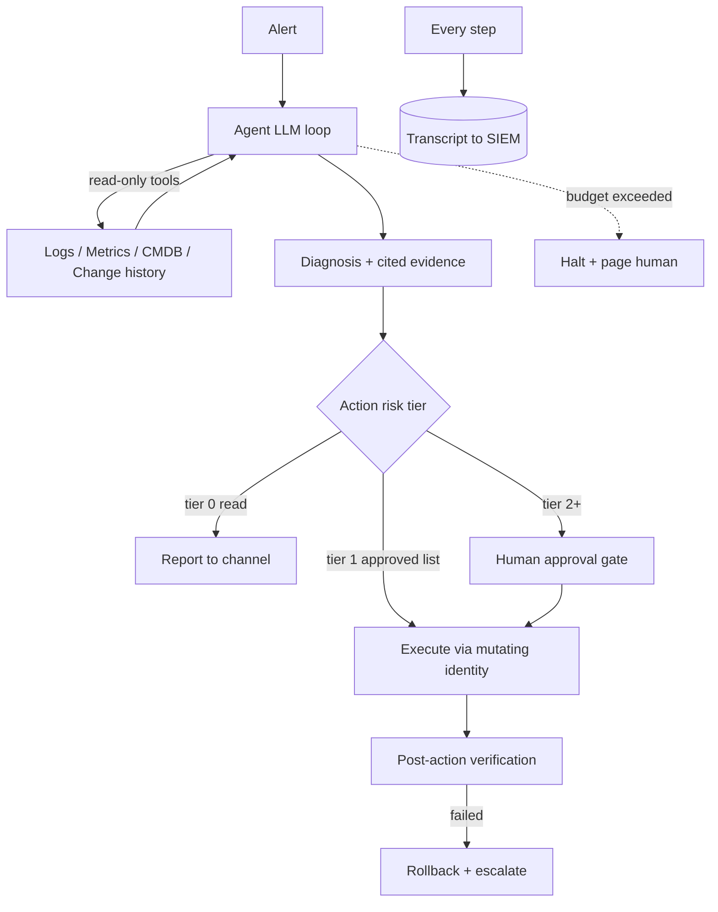

# AI-Assisted Runbooks & Agentic Operations

**Level:** Expert
**Tree:** [Workflow Orchestration & AI Automation](../README.md)
**Branch:** [MCP & AI-Assisted Operations](README.md)
**Forest:** [Automation & Scripting](../../../README.md)

## Explanation

# Agentic Operations: AI in the Ops Loop

The frontier of IT automation is the **agentic loop**: an LLM given observations (alert payload, logs, metrics), tools (via MCP or function calling), and a goal, iterating — observe, reason, act, observe — until resolution or escalation. Done well it compresses mean-time-to-diagnosis dramatically; done carelessly it hands production credentials to a stochastic system. The engineering discipline lies in the guardrails.

**Maturity ladder**: Level 1, AI summarizes and drafts (incident summaries, runbook drafts) — human executes everything. Level 2, AI investigates via read-only tools and proposes a diagnosis with evidence links. Level 3, AI executes pre-approved runbook actions for known signatures with human approval gates on anything destructive. Level 4, closed-loop remediation for a whitelisted action catalog with post-hoc review. Most enterprises should climb one level at a time, measuring false-action rates before promotion.

**Architectural guardrails**: read-only versus mutating tool separation with different identities; an **action allowlist** with per-action risk tiers; change-window and blast-radius checks enforced in the tool layer, not the prompt; mandatory evidence citation (the agent must show the log lines supporting a diagnosis); token/cost/iteration budgets so a confused agent halts rather than loops; and a kill switch. Every session is transcribed to the SIEM — the agent is a privileged operator and gets audited like one.

**Runbooks become agent-legible**: structured markdown with explicit preconditions, decision criteria, commands, and rollback steps doubles as human documentation and agent instructions. Write runbooks as if a competent-but-literal junior engineer will execute them at 3 a.m. — because functionally, one will. Evaluation is continuous: replay past incidents against the agent in staging, score diagnosis accuracy, and track intervention rates. The operators who thrive are those who curate tools, evidence standards, and guardrails — the skill shifts from typing commands to engineering the system that acts.

## Architecture and flow



## Commands

### Command 1

Audit which tools an ops agent invoked in the last hour

```text
kubectl logs deploy/agent-runner --since=1h | jq 'select(.event=="tool_call") | {tool, args, risk_tier}'
```

### Command 2

Review all Azure actions performed by the agent's identity

```text
az monitor activity-log list --offset 1h --query "[?caller=='agent-svc@corp.com'].{op:operationName.value, rg:resourceGroupName, status:status.value}" -o table
```

### Command 3

Activate the agent kill switch during a change freeze

```text
curl -sS -X POST http://agent-gw.corp.local/v1/killswitch -H "Authorization: Bearer $OPS_TOKEN" -d '{"scope":"all","reason":"CHG-99231 freeze"}'
```

### Command 4

Compute the agent's 7-day action rollback rate

```text
promtool query instant http://prom:9090 'sum(rate(agent_actions_total{outcome="rolled_back"}[7d])) / sum(rate(agent_actions_total[7d]))'
```

## Automation scripts

### action_gateway.py

```python
#!/usr/bin/env python3
"""Policy gateway between an ops agent and real actions: allowlist, risk tiers,
change-window check, and audit. The agent calls this, never the target APIs."""
import json
import logging
from datetime import datetime, timezone

logging.basicConfig(level=logging.INFO, format="%(asctime)s %(levelname)s %(message)s")
log = logging.getLogger("gateway")

ACTION_CATALOG = {
    "restart_service": {"tier": 1, "rollback": "none - service restart"},
    "scale_deployment": {"tier": 1, "rollback": "scale to previous replica count"},
    "disable_user": {"tier": 2, "rollback": "re-enable account"},
    "delete_resource": {"tier": 3, "rollback": "restore from backup"},
}
MAX_AUTO_TIER = 1
FREEZE_ACTIVE = False  # set by change-management integration

def evaluate(request: dict) -> dict:
    action = request.get("action", "")
    args = request.get("args", {})
    entry = ACTION_CATALOG.get(action)
    decision = {"action": action, "args": args,
                "ts": datetime.now(timezone.utc).isoformat()}
    if entry is None:
        decision.update(verdict="DENY", reason="action not in catalog")
    elif FREEZE_ACTIVE:
        decision.update(verdict="DENY", reason="change freeze active")
    elif entry["tier"] > MAX_AUTO_TIER:
        decision.update(verdict="NEEDS_APPROVAL",
                        reason=f"tier {entry['tier']} exceeds auto limit",
                        rollback=entry["rollback"])
    else:
        decision.update(verdict="ALLOW", rollback=entry["rollback"])
    log.info(json.dumps(decision))
    return decision

if __name__ == "__main__":
    tests = [
        {"action": "restart_service", "args": {"host": "web01", "service": "nginx"}},
        {"action": "disable_user", "args": {"upn": "j.doe@corp.com"}},
        {"action": "format_disk", "args": {"host": "db01"}},
    ]
    for t in tests:
        print(evaluate(t)["verdict"], "-", t["action"])
```

## Lab

**Objective:** Assemble a Level 2-3 agentic incident loop: read-only investigation, policy-gated action, and full audit.

### Steps

1. Expose read-only tools (log query, metric query, CMDB lookup) via an MCP server with a read-only identity.
2. Implement the action gateway with a three-tier catalog and a change-freeze flag.
3. Wire an agent (any LLM with tool calling) to investigate a simulated disk-full alert using only read tools.
4. Require the agent to produce a diagnosis with cited log evidence before any action request.
5. Let it request cleanup (tier 1 - auto) and then a service disable (tier 2 - approval); approve via the gate.
6. Flip the freeze flag and confirm all actions are denied; review the complete audit trail.

### Validation

Agent diagnosis includes verbatim log lines as evidence.,Tier 1 action executes; tier 2 waits for approval; unknown action is denied outright.,Gateway log reconstructs the full session: every tool call, verdict, and timestamp.

## Operational automation

## Industrializing agentic ops

- Convert the runbook library to structured, agent-legible markdown with preconditions and rollback per step; lint it in CI.
- Replay harness: past incidents replayed nightly against the agent in staging; diagnosis accuracy and proposed-action correctness scored and trended.
- Promotion gates between maturity levels tied to measured false-action rate thresholds.
- Separate identities per tier with PIM-style elevation for the mutating identity, activated only by the gateway.
- Weekly review ritual: sample agent transcripts, grade evidence quality, feed corrections back as few-shot examples or tool-description fixes.

## Troubleshooting

### Scenario 1: Agent confidently proposes actions on the wrong host

**Likely cause:** Ambiguous alert payload plus no evidence requirement lets the model fill gaps by guessing

**Resolution:** Enforce evidence citation in the output contract, validate host arguments against the alert's CI in the gateway, and reject action requests referencing entities absent from the investigation context

### Scenario 2: Agent loops burning tokens without converging

**Likely cause:** No iteration/cost budget and tools returning huge unfiltered payloads that drown the context

**Resolution:** Cap iterations and tokens per session with hard halt-and-page, paginate and summarize tool outputs server-side, and add a scratchpad summary step every N iterations

### Scenario 3: Approved automation suddenly acting during a change freeze

**Likely cause:** Freeze enforced only in prompts, which the model can ignore or lose from context

**Resolution:** Enforce freezes, windows, and blast-radius limits in the gateway code path — policy must live in the tool layer where it cannot be reasoned around

## Interview questions

### 1. Why must guardrails live in the tool layer rather than the prompt?

Prompts are suggestions to a probabilistic system — context truncation, injection, or plain sampling variance can override them. Code-level enforcement (allowlists, risk tiers, freeze checks, argument validation in the gateway) is deterministic and auditable. Prompts shape behavior; the gateway bounds it.

### 2. Describe a sane maturity path for AI in operations.

Start with summarization and draft generation (no execution), then read-only investigation with evidence-cited diagnoses, then execution of a small approved action catalog behind human approval, then closed-loop for well-measured low-risk signatures. Each promotion requires measured false-action rates below agreed thresholds, and a kill switch exists throughout.

### 3. How do you audit an AI operator?

Identically to a privileged human, plus more: dedicated identities so cloud audit logs attribute every action, full session transcripts (observations, reasoning, tool calls, verdicts) shipped to SIEM, rollback-rate and intervention-rate metrics, and periodic transcript sampling reviews. If you cannot reconstruct why it acted, it should not be acting.

### 4. What changes about runbook writing in the agentic era?

Runbooks become executable specifications: explicit preconditions, unambiguous decision criteria, exact commands with expected outputs, and rollback per step — no tribal knowledge or 'use judgment' gaps. The same rigor that makes a runbook agent-safe makes it better for the 3 a.m. human, so the investment pays twice.

## Certification alignment

- AI-102 - Design and implement agentic solutions with tools
- SC-100 - Design security operations incorporating AI and automation
- AZ-305 - Design operational excellence with emerging automation patterns

## References

- Anthropic: Building effective agents (engineering guidance)
- Google SRE Book: automation progression and safe rollouts
- modelcontextprotocol.io - tool safety and human-in-the-loop guidance

## Suggested video search

AI agents incident response runbook automation guardrails LLM operations

---

> Validate commands, versions, permissions, licensing, and rollback procedures in an isolated lab before production use.
