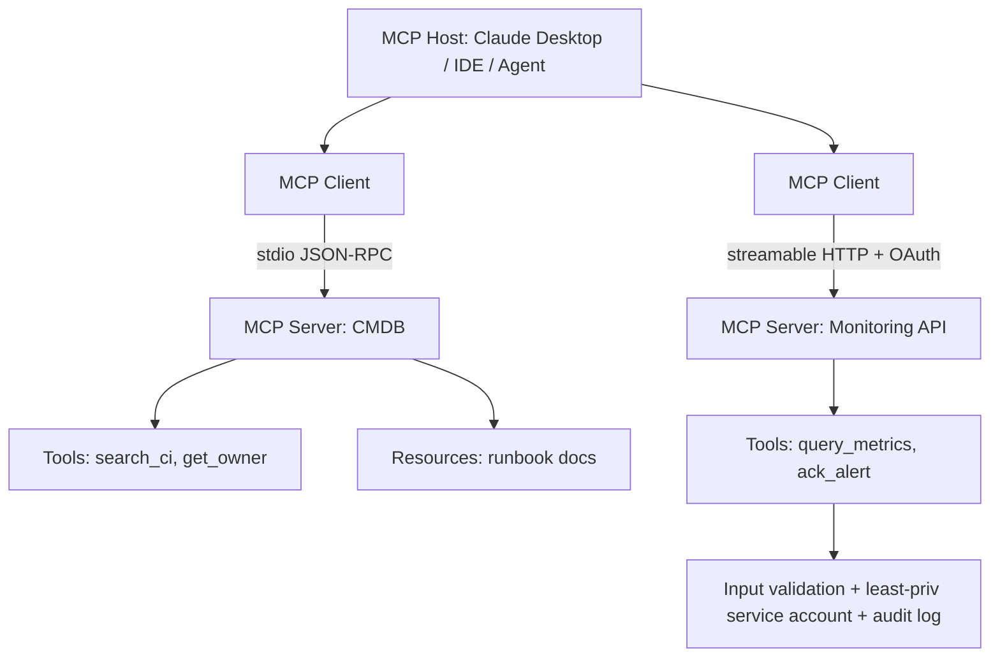

# Model Context Protocol (MCP) Fundamentals

**Level:** Advanced
**Tree:** [Workflow Orchestration & AI Automation](../README.md)
**Branch:** [MCP & AI-Assisted Operations](README.md)
**Forest:** [Automation & Scripting](../../../README.md)

## Explanation

# Model Context Protocol

MCP is an open protocol (introduced by Anthropic in late 2024, since adopted broadly across the AI tooling ecosystem) that standardizes how AI applications connect to external systems — solving the N-by-M integration problem where every AI client needed bespoke connectors to every tool. It is JSON-RPC 2.0 based with a client-server architecture: an **MCP host** (Claude Desktop, an IDE, a custom agent) runs **MCP clients**, each holding a stateful session to one **MCP server** that fronts a system of record.

Servers expose three primitives. **Tools** are model-invoked functions with JSON Schema input definitions (query_database, restart_service) — the model decides when to call them, making tool descriptions effectively prompt engineering. **Resources** are application-controlled data the host can attach as context (files, tickets, configuration). **Prompts** are user-invoked templates (slash-command style) for repeatable interactions. Transports: **stdio** for local servers spawned as child processes, and **streamable HTTP** for remote servers, with OAuth 2.1 as the authorization framework on the remote path.

For IT operations this converts AI assistants from advisors into operators: an MCP server wrapping your CMDB, monitoring API, or runbook automation lets an agent investigate an alert — query metrics, correlate changes, read the runbook — and propose or execute remediation through audited tool calls. The security posture must match the power: servers run with least-privilege service accounts, destructive tools require explicit human confirmation (human-in-the-loop is a design principle of the protocol), inputs are validated server-side because the model's arguments are untrusted, and every call is logged. Treat third-party MCP servers like any supply-chain dependency — review before granting credentials, since a malicious server sees whatever context the session shares with it.

## Architecture and flow



## Commands

### Command 1

Launch the MCP Inspector to interactively test a local server's tools

```text
npx @modelcontextprotocol/inspector node dist/server.js
```

### Command 2

Install the Python SDK and run a server in dev mode

```text
pip install "mcp[cli]" && python -m mcp dev server.py
```

### Command 3

List a streamable-HTTP server's tools via raw JSON-RPC

```text
curl -sS -X POST http://localhost:8000/mcp -H 'Content-Type: application/json' -d '{"jsonrpc":"2.0","id":1,"method":"tools/list"}'
```

### Command 4

Register a local MCP server with an MCP-capable editor

```text
code --add-mcp '{"name":"cmdb","command":"node","args":["dist/server.js"]}'
```

## Automation scripts

### ops_mcp_server.py

```python
#!/usr/bin/env python3
"""MCP server exposing read-only ops tools with validation and audit logging."""
import json
import logging
import re
from datetime import datetime, timezone

from mcp.server.fastmcp import FastMCP

logging.basicConfig(filename="mcp-audit.log", level=logging.INFO,
                    format="%(asctime)s %(message)s")
audit = logging.getLogger("audit")

mcp = FastMCP("ops-tools")

HOST_RE = re.compile(r"^[a-zA-Z0-9][a-zA-Z0-9.-]{1,63}$")

INVENTORY = {
    "web01": {"owner": "platform-team", "env": "prod", "os": "Ubuntu 22.04"},
    "db01": {"owner": "data-team", "env": "prod", "os": "RHEL 9"},
}

@mcp.tool()
def get_host_info(hostname: str) -> str:
    """Look up owner, environment, and OS for a host in the CMDB.

    Args:
        hostname: Short hostname, e.g. web01
    """
    if not HOST_RE.match(hostname):
        raise ValueError("Invalid hostname format")
    audit.info(json.dumps({"tool": "get_host_info", "arg": hostname,
                           "ts": datetime.now(timezone.utc).isoformat()}))
    info = INVENTORY.get(hostname.lower())
    if info is None:
        return f"Host {hostname} not found in CMDB."
    return json.dumps({"hostname": hostname, **info})

@mcp.tool()
def list_prod_hosts() -> str:
    """List all production hosts with their owning teams."""
    audit.info(json.dumps({"tool": "list_prod_hosts",
                           "ts": datetime.now(timezone.utc).isoformat()}))
    prod = {h: v for h, v in INVENTORY.items() if v["env"] == "prod"}
    return json.dumps(prod)

if __name__ == "__main__":
    mcp.run(transport="stdio")
```

## Lab

**Objective:** Build, inspect, and safely consume a custom MCP server exposing CMDB-style tools to an AI client.

### Steps

1. Install the MCP Python SDK and implement the two read-only tools with input validation and audit logging.
2. Exercise the server with MCP Inspector: list tools, call them with valid and invalid arguments.
3. Register the server with an MCP-capable client (Claude Desktop config or IDE).
4. Ask the assistant an operational question and observe which tools it chooses and why.
5. Add a destructive stub tool (restart_service) that only returns a proposed action requiring confirmation.
6. Review the audit log and confirm every invocation is captured with arguments and timestamps.

### Validation

Inspector shows both tools with their JSON Schemas derived from type hints and docstrings.,Invalid hostname input returns a validation error, not a crash or an injection path.,Audit log lines exist for every call made during the assistant session.

## Operational automation

## MCP in the operations estate

- Package servers as containers; deploy remote servers behind OAuth with per-team scopes rather than sharing one privileged instance.
- Generate MCP servers over existing REST APIs from their OpenAPI specs, then curate: fewer, well-described tools outperform a 1:1 endpoint dump.
- Gate destructive tools behind confirmation patterns and change-window checks server-side — never trust the model to self-restrain.
- Centralize audit: ship tool-call logs to the SIEM with the same retention as human admin actions.
- Maintain an internal registry of approved servers with owners and review status, mirroring package-repository governance.

## Troubleshooting

### Scenario 1: Client connects but the model never uses an available tool

**Likely cause:** Vague tool name/description — the model cannot map intent to the tool

**Resolution:** Rewrite descriptions to state precisely what the tool answers and when to use it, with concrete argument examples; test with Inspector and iterate like prompt engineering

### Scenario 2: stdio server works in Inspector but fails from the desktop client

**Likely cause:** The client spawns the process with a different working directory, PATH, or missing env vars

**Resolution:** Use absolute paths in the client config, declare required env vars explicitly in the server entry, and log startup context to a file since stdout is reserved for the protocol

### Scenario 3: Server crashes when printing debug output

**Likely cause:** Writing logs to stdout corrupts the JSON-RPC stdio stream

**Resolution:** Route all logging to stderr or a file; stdout must carry only protocol messages on stdio transport

## Interview questions

### 1. What problem does MCP actually solve?

The N-by-M connector explosion: before MCP every AI application integrated every tool bespoke. MCP standardizes the interface (JSON-RPC, three primitives, two transports) so a tool wrapped once as a server is usable by any compliant host — USB-C for AI-tool connectivity, shifting effort from plumbing to curation and governance.

### 2. Distinguish tools, resources, and prompts and who controls each.

Tools are model-controlled functions — the LLM decides invocation based on schema and description. Resources are application-controlled context data the host attaches. Prompts are user-controlled templates invoked explicitly. The control distinction is the design core: it determines what the model may autonomously do versus what humans and hosts feed it.

### 3. How do you make an MCP server safe enough for production operations?

Least-privilege service identity per server; server-side validation of all arguments (model output is untrusted input); read-only by default with destructive tools requiring explicit confirmation flows; OAuth with scoped tokens on remote transport; full audit logging to SIEM; and supply-chain review of any third-party server before it receives credentials.

### 4. Why is tool description quality an engineering concern?

Descriptions are the model's only interface documentation — selection accuracy, argument correctness, and appropriate use all hinge on them. Ambiguous descriptions cause wrong-tool calls and hallucinated arguments. Teams iterate on them with evaluation runs exactly as they would tune prompts or API docs.

## Certification alignment

- AI-102 - Integrate generative AI with external tools and functions
- SC-100 - Extend Zero Trust governance to AI operational tooling
- AZ-305 - Design integration architectures for emerging AI workloads

## References

- modelcontextprotocol.io - specification, architecture, and SDK docs
- Anthropic engineering blog: introducing and building with MCP
- MCP Inspector and reference servers (modelcontextprotocol on GitHub)

## Suggested video search

Model Context Protocol MCP server tutorial tools resources architecture

---

> Validate commands, versions, permissions, licensing, and rollback procedures in an isolated lab before production use.
