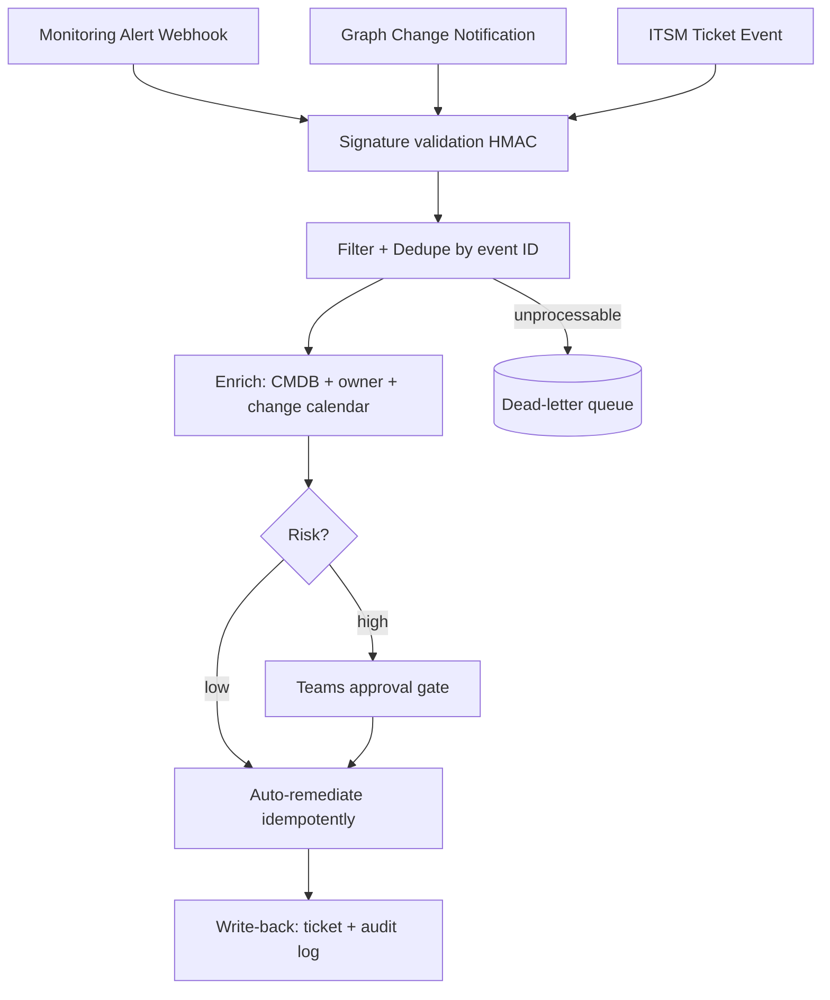

# Event-Driven IT Operations Patterns

**Level:** Advanced
**Tree:** [Workflow Orchestration & AI Automation](../README.md)
**Branch:** [n8n Workflow Automation](README.md)
**Forest:** [Automation & Scripting](../../../README.md)

## Explanation

# Event-Driven Operations

Mature IT automation is event-driven: systems emit events (alert fired, user created, certificate near expiry, ticket updated) and workflows react — replacing both swivel-chair manual work and brittle nightly batch sweeps. The architecture has three layers: **event sources** (webhooks from monitoring/ITSM, Entra provisioning events via Graph change notifications, Event Grid, message queues), an **orchestration layer** (n8n, Logic Apps, or code) that filters, enriches, decides, and acts, and **action targets** (APIs, scripts, ticketing, chat).

Design principles carry more weight than tooling. **Idempotency**: events arrive at-least-once, so every action must be safe to repeat — check current state before mutating, or key actions on an idempotency token derived from the event ID. **Ordering**: most transports do not guarantee it; design handlers to converge on desired state rather than assume sequence. **Enrichment before action**: an alert with hostname alone becomes actionable after CMDB, ownership, and change-calendar lookups — the difference between noise forwarding and automation. **Human-in-the-loop gates** for risky actions: the workflow proposes (disable account, reboot node), a human approves in Teams/Slack, the workflow executes and documents. **Dead-letter handling**: unprocessable events go to a review queue, never silently dropped.

Security of the event plane is frequently neglected: webhook endpoints must validate signatures (HMAC) or mutual TLS, secrets rotate, and the orchestrator's identities follow least privilege per workflow — a workflow that only enriches tickets must not hold user-disable permissions. Measure everything: events in, actions taken, approval latency, failure rate. The goal-state is a catalog of small, owned, observable automations — each one boring — that collectively remove entire categories of toil, from JML (joiner-mover-leaver) to alert auto-remediation with documented evidence trails.

## Architecture and flow



## Commands

### Command 1

Compute the HMAC signature to validate an incoming webhook

```text
openssl dgst -sha256 -hmac "$WEBHOOK_SECRET" payload.json
```

### Command 2

Subscribe a workflow endpoint to Azure resource events

```text
az eventgrid system-topic event-subscription create --name vm-events --system-topic-name subs-topic -g rg-events --endpoint https://n8n.corp.local/webhook/azure-events --endpoint-type webhook
```

### Command 3

Create a Graph change notification subscription for user changes

```text
curl -sS -X POST https://graph.microsoft.com/v1.0/subscriptions -H "Authorization: Bearer $TOKEN" -H 'Content-Type: application/json' -d '{"changeType":"updated","notificationUrl":"https://n8n.corp.local/webhook/user-changes","resource":"/users","expirationDateTime":"2026-07-24T00:00:00Z","clientState":"secretValidation"}'
```

### Command 4

Detect duplicate event IDs in a captured event stream

```text
jq -r '.eventId' event.json | sort | uniq -d
```

## Automation scripts

### webhook_receiver.py

```python
#!/usr/bin/env python3
"""Minimal hardened webhook receiver: HMAC validation, dedupe, dead-letter."""
import hashlib
import hmac
import json
import logging
import os
import sqlite3
from http.server import BaseHTTPRequestHandler, HTTPServer

SECRET = os.environ.get("WEBHOOK_SECRET", "")
DB = sqlite3.connect("events.db", check_same_thread=False)
DB.execute("CREATE TABLE IF NOT EXISTS seen (id TEXT PRIMARY KEY, ts DATETIME DEFAULT CURRENT_TIMESTAMP)")
log = logging.getLogger("receiver")
logging.basicConfig(level=logging.INFO, format="%(asctime)s %(levelname)s %(message)s")

class Handler(BaseHTTPRequestHandler):
    def do_POST(self):
        body = self.rfile.read(int(self.headers.get("Content-Length", 0)))
        sig = self.headers.get("X-Signature-256", "")
        expected = "sha256=" + hmac.new(SECRET.encode(), body, hashlib.sha256).hexdigest()
        if not SECRET or not hmac.compare_digest(sig, expected):
            log.warning("rejected: bad signature from %s", self.client_address[0])
            self.send_response(401); self.end_headers(); return
        try:
            event = json.loads(body)
            eid = event["eventId"]
        except (json.JSONDecodeError, KeyError) as err:
            log.error("dead-letter: unparseable event (%s)", err)
            with open("dead-letter.jsonl", "ab") as fh:
                fh.write(body + b"\n")
            self.send_response(400); self.end_headers(); return
        try:
            DB.execute("INSERT INTO seen (id) VALUES (?)", (eid,))
            DB.commit()
        except sqlite3.IntegrityError:
            log.info("duplicate suppressed: %s", eid)
            self.send_response(200); self.end_headers(); return
        log.info("accepted event %s type=%s", eid, event.get("type"))
        # hand off to orchestrator/queue here
        self.send_response(202); self.end_headers()

if __name__ == "__main__":
    if not SECRET:
        raise SystemExit("WEBHOOK_SECRET must be set")
    HTTPServer(("0.0.0.0", 8443), Handler).serve_forever()
```

## Lab

**Objective:** Build an alert auto-remediation loop with signature validation, dedupe, approval gating, and dead-lettering.

### Steps

1. Stand up the webhook receiver (or an n8n webhook) with HMAC validation using a shared secret.
2. Point a monitoring test alert (or curl simulation) at it; verify tampered payloads are rejected 401.
3. Send the same event ID twice and confirm the duplicate is suppressed.
4. Add enrichment: look up the affected host's owner from a CSV/CMDB stub.
5. Route disk-space alerts to auto-remediation (cleanup script) and service-down alerts to a Teams approval before restart.
6. Send a malformed event and verify it lands in the dead-letter file with an alert.

### Validation

Signature mismatch returns 401 and logs the source IP.,Duplicate event produces exactly one remediation action.,Dead-letter file contains the malformed payload; approval path shows the full decision trail.

## Operational automation

## Scaling the event fabric

- Introduce a real queue (Service Bus, RabbitMQ) between receivers and workers once volume or ordering pressure appears; retry with DLQ becomes platform-native.
- Renew Graph subscriptions automatically (they expire in days) with a scheduled workflow.
- Auto-generate runbook links into every notification so humans landing on an approval have context one click away.
- Track automation coverage: percentage of alert types with a handler; drive it up sprint by sprint.
- Chaos-test handlers quarterly by replaying captured event storms against staging.

## Troubleshooting

### Scenario 1: Same remediation executed multiple times for one incident

**Likely cause:** At-least-once delivery plus a non-idempotent handler without dedupe

**Resolution:** Dedupe on event ID before acting and make the action state-checking (verify service still down before restart); keep a processed-events store with TTL

### Scenario 2: Graph change notifications silently stop arriving

**Likely cause:** Subscription expired (max lifetime is short) or the endpoint failed validation renewal

**Resolution:** Scheduled job lists subscriptions and renews before expirationDateTime; alert if renewal fails; verify clientState on every notification

### Scenario 3: Event storm overwhelms the orchestrator and actions queue for hours

**Likely cause:** No rate limiting or storm detection; each of 5,000 host alerts triggers a full workflow

**Resolution:** Add storm detection (collapse events by correlation key within a window), a queue with worker concurrency caps, and a circuit breaker that switches to summary-and-page mode above a threshold

## Interview questions

### 1. Why must event-driven handlers be idempotent, and how do you achieve it?

Every practical transport is at-least-once — retries, redeliveries, and replays guarantee duplicates. Idempotency comes from deduplication on a stable event ID, state verification before action (is the service actually still down?), and idempotency keys on downstream API calls so repeats become no-ops.

### 2. Where do humans belong in automated operations?

At risk gates and ambiguity points: automation prepares full context and a proposed action; a human approves in chat with one click; the workflow executes and writes back evidence. Purely mechanical, reversible, well-understood actions graduate to full auto-remediation after a supervised period with measured false-positive rates.

### 3. How do you secure a webhook-driven automation plane?

HMAC signature or mTLS on every endpoint, per-source secrets rotated on schedule, clientState validation for Graph, allowlisted source ranges where feasible, least-privilege identities per workflow (enrich-only workflows cannot mutate), and full audit of event-to-action chains. An unauthenticated webhook that disables accounts is an attacker's API.

### 4. Batch sweeps versus event-driven — is batch dead?

No. Events give latency and efficiency, but reconciliation sweeps catch missed events, subscription gaps, and drift — the same reason GitOps reconciles continuously. Mature designs run both: events for speed, periodic reconciliation for correctness, with the sweep alerting when it finds work events should have handled.

## Certification alignment

- AZ-305 - Design event-driven and messaging architectures
- AZ-400 - Implement appropriate automation and feedback mechanisms
- SC-100 - Design security for operational technology and automation planes

## References

- Microsoft Graph documentation: change notifications and subscription lifecycle
- Azure Architecture Center: event-driven architecture style and idempotency patterns
- Google SRE Workbook: eliminating toil and automation progression

## Suggested video search

event driven automation webhooks idempotency human in the loop itops

---

> Validate commands, versions, permissions, licensing, and rollback procedures in an isolated lab before production use.
