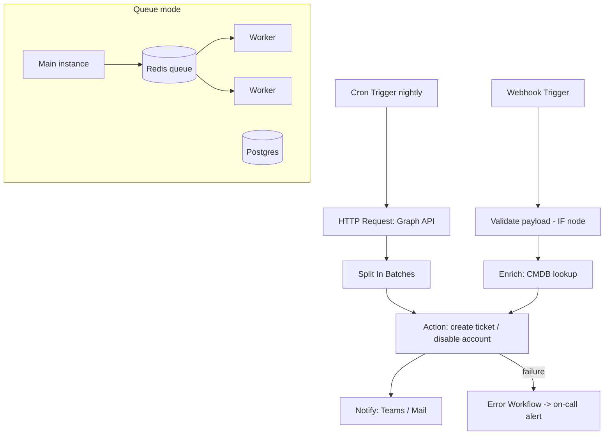

# n8n and Node-RED Flow Automation: Self-Hosted Integration Design

**Level:** Intermediate
**Tree:** [Workflow Orchestration & AI Automation](../README.md)
**Branch:** [n8n Workflow Automation](README.md)
**Forest:** [Automation & Scripting](../../../README.md)

## Explanation

# n8n for Enterprise Automation

n8n is a source-available, self-hostable workflow automation platform — the glue layer between SaaS APIs, internal systems, and scripts, in the same category as Zapier or Power Automate but deployable inside your own network boundary, which is decisive for data-residency-sensitive enterprises.

A **workflow** is a directed graph of **nodes**: a trigger node (webhook, cron/schedule, IMAP, queue message, or app-specific triggers) followed by action and logic nodes. Data flows between nodes as an **array of items** (each item a JSON object, optionally with binary attachments); every node executes once per item unless configured otherwise — the single most important mental model, since misunderstanding item-wise execution causes most beginner bugs. Expressions reference upstream data, and the **Code node** (JavaScript or Python) covers gaps between the 400+ built-in nodes. The generic **HTTP Request node** with stored credentials talks to anything with an API, making n8n effectively a visual REST client with state.

Control flow: IF/Switch for branching, Merge for joins, Split In Batches (Loop) for chunked processing of large sets, Wait for delays and human-approval patterns, and error workflows — a designated workflow triggered whenever another fails, centralizing alerting.

Production deployment matters: run in **queue mode** (main instance plus Redis plus workers) for scale and zero-downtime restarts, back with Postgres rather than SQLite, encrypt credentials with a pinned encryption key, put SSO/OIDC in front, and export workflows as JSON into git for versioning and promotion between dev and prod instances. Typical enterprise wins: joiner-mover-leaver automation calling Graph, incident enrichment between monitoring and ITSM, certificate-expiry sweeps, and approval-gated resource provisioning.

## Architecture and flow



## Commands

### Command 1

Run n8n with Postgres backend and pinned credential encryption key

```text
docker run -d --name n8n -p 5678:5678 -e N8N_ENCRYPTION_KEY=$ENC_KEY -e DB_TYPE=postgresdb -e DB_POSTGRESDB_HOST=pg -v n8n_data:/home/node/.n8n docker.n8n.io/n8nio/n8n
```

### Command 2

Export all workflows as individual JSON files for git

```text
n8n export:workflow --all --output=./workflows --separate
```

### Command 3

Import workflow JSON into another instance (promotion)

```text
n8n import:workflow --separate --input=./workflows
```

### Command 4

Trigger a production webhook workflow

```text
curl -sS -X POST https://n8n.corp.local/webhook/new-hire -H 'Content-Type: application/json' -d '{"upn":"j.doe@corp.com","dept":"IT"}'
```

## Automation scripts

### n8n-code-node-dedupe.js

```python
// n8n Code node (JavaScript): dedupe items by UPN and flag stale accounts
// Input: items from a Graph users query; Output: unique, annotated items
const seen = new Set();
const out = [];
const cutoff = new Date();
cutoff.setDate(cutoff.getDate() - 90);

for (const item of items) {
  const upn = (item.json.userPrincipalName || '').toLowerCase();
  if (!upn || seen.has(upn)) continue;
  seen.add(upn);
  const lastSignIn = item.json.signInActivity && item.json.signInActivity.lastSignInDateTime
    ? new Date(item.json.signInActivity.lastSignInDateTime)
    : null;
  out.push({
    json: {
      upn: upn,
      displayName: item.json.displayName,
      stale: !lastSignIn || lastSignIn < cutoff,
      lastSignIn: lastSignIn ? lastSignIn.toISOString() : 'never'
    }
  });
}
if (out.length === 0) {
  throw new Error('No valid user items received - upstream query may have failed');
}
return out;
```

## Lab

**Objective:** Build a production-shaped joiner workflow: webhook intake, validation, Graph account check, approval gate, and error workflow.

### Steps

1. Deploy n8n via Docker with Postgres and a pinned encryption key.
2. Create a webhook-triggered workflow validating required fields with an IF node and returning 400 on bad input.
3. Add an HTTP Request node calling Microsoft Graph (client credentials) to check whether the UPN already exists.
4. Insert a Wait-for-approval step (send Teams message with resume webhook link).
5. On approval, create a ticket via a REST call and notify the requester.
6. Create an error workflow posting failures to a channel, and link it; then break the Graph credential to test it.

### Validation

Invalid payload returns HTTP 400 with a validation message.,Duplicate UPN takes the reject branch; new UPN reaches the approval step.,Broken credential run fires the error workflow with the failed node name and execution URL.

## Operational automation

## n8n as a managed platform

- Instances defined in IaC (container images, env config); workflows exported to git and promoted dev-to-prod via the CLI in a pipeline.
- Queue mode with Redis and horizontal workers; readiness probes on /healthz behind the load balancer.
- Central error workflow pattern plus execution-data pruning policies to control database growth.
- Credentials backed by vault-injected env vars; SSO via OIDC proxy; audit exports of workflow changes.
- Treat business-critical workflows like services: version, owner, runbook, and alerting on failure rate.

## Troubleshooting

### Scenario 1: Node ran many times when one execution was expected

**Likely cause:** Item-wise execution: the previous node emitted N items, so this node ran per item

**Resolution:** Aggregate items first (Item Lists/Aggregate node or Code node returning one item), or set Execute Once on the node when it must run once per execution

### Scenario 2: Webhook works in test mode but 404s in production

**Likely cause:** Test URLs are ephemeral and only live while listening in the editor; workflow not activated

**Resolution:** Activate the workflow and use the production webhook URL; behind a proxy, ensure WEBHOOK_URL env var matches the external hostname

### Scenario 3: Credentials fail after migrating the instance

**Likely cause:** N8N_ENCRYPTION_KEY differs from the key that encrypted stored credentials

**Resolution:** Restore the original encryption key from the vault backup; without it credentials are unrecoverable and must be re-entered

## Interview questions

### 1. Why choose self-hosted n8n over Power Automate or Zapier in an enterprise?

Data residency and network reach: n8n runs inside your boundary, can call internal-only APIs, and workflow data never transits a third party. Add per-instance cost economics at volume, full workflow-as-JSON versioning in git, and Code nodes for arbitrary logic. Power Automate wins when the estate is M365-centric and licensing already covers it.

### 2. Explain n8n's data model and its most common pitfall.

Nodes pass arrays of items; each downstream node executes per item. The pitfall is unintended fan-out — a node emitting 50 items causes 50 downstream API calls or notifications. Fixes are aggregation nodes, Execute Once, and deliberate batching with Split In Batches for controlled loops.

### 3. How do you make an n8n workflow production-grade?

Idempotent actions (check-before-create), input validation with explicit failure responses, linked error workflow for alerting, retry configuration on flaky nodes, queue-mode infrastructure with Postgres, credentials from a vault with a pinned encryption key, git-versioned workflow JSON, and promotion through a non-prod instance first.

### 4. Where does n8n fit relative to scripts and full orchestrators?

Scripts excel at depth on one system; n8n excels at breadth — stitching webhooks, SaaS APIs, approvals, and notifications with visible state and non-developer maintainability. Heavy data pipelines belong in Airflow-class tools; deep single-system logic stays in PowerShell/Python invoked by n8n. It is the integration and human-in-the-loop layer.

## Certification alignment

- AZ-400 - Design integration and automation workflows (concept transfer)
- PL-500 (comparative) - Power Automate RPA equivalence mapping
- AZ-305 - Design application integration patterns

## References

- n8n documentation: hosting, queue mode, and data structure
- n8n documentation: error handling and error workflows
- n8n workflow templates library (n8n.io/workflows)

## Suggested video search

n8n self-hosted tutorial queue mode error workflow enterprise

---

> Validate commands, versions, permissions, licensing, and rollback procedures in an isolated lab before production use.
