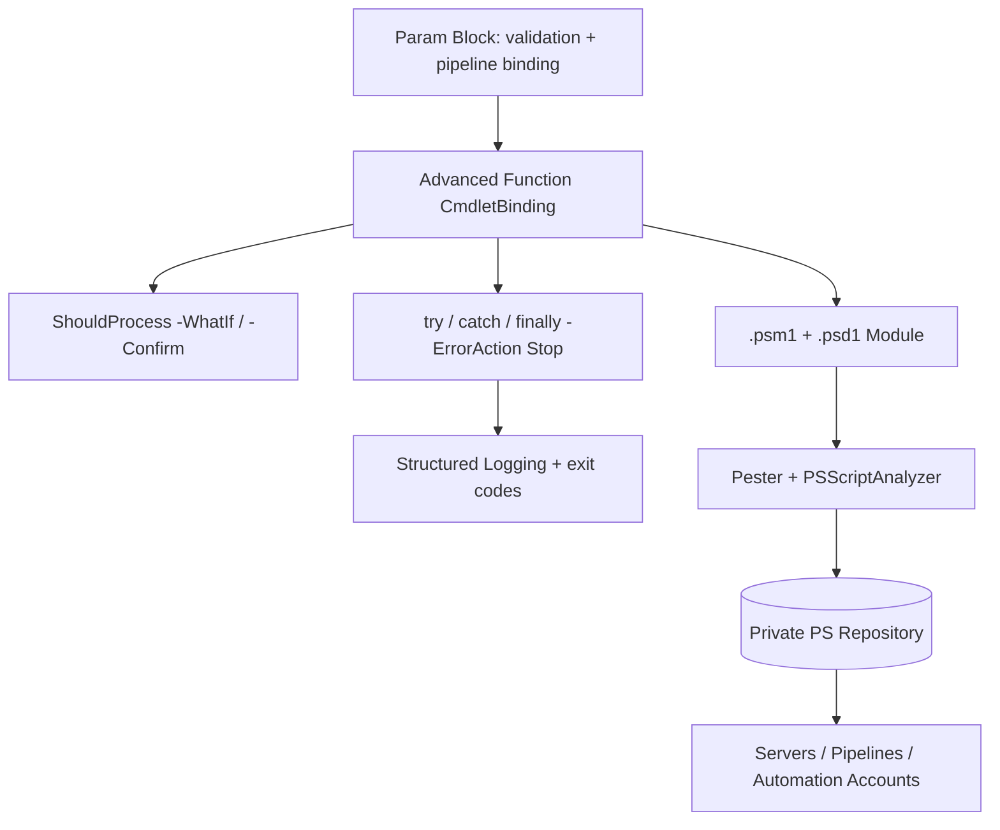

# PowerShell Advanced Functions, Error Handling and Modules

**Level:** Advanced
**Tree:** [Scripting Languages](../README.md)
**Branch:** [PowerShell for Operations](README.md)
**Forest:** [Automation & Scripting](../../../README.md)

## Explanation

# Production PowerShell

The gap between a working snippet and production PowerShell is structure: **advanced functions** with [CmdletBinding()], typed and validated parameters (Mandatory, ValidateSet, ValidateScript, pipeline binding via ValueFromPipeline), and support for -WhatIf/-Confirm through SupportsShouldProcess — mandatory for anything destructive.

**Error handling** is where most scripts fail review. PowerShell has terminating and non-terminating errors; try/catch only catches terminating ones, so set -ErrorAction Stop on cmdlets whose failures matter (or $ErrorActionPreference = 'Stop' at scope). Catch specific exception types where you can, log $_.Exception.Message plus $_.ScriptStackTrace, and use finally for cleanup. Return proper exit codes for schedulers, and never swallow errors silently — an automation platform is only as trustworthy as its failure signals.

**Modules** turn scripts into a maintainable estate: a .psm1 with Export-ModuleMember, a .psd1 manifest with versioning and RequiredModules, Pester tests, PSScriptAnalyzer clean, published to a **private PowerShell repository** (Azure Artifacts or a NuGet feed) so every server and pipeline installs the same version. PowerShell 7+ is the target runtime — cross-platform, side-by-side with Windows PowerShell 5.1, with ForEach-Object -Parallel and ternary support.

**Secrets** never live in scripts: use the SecretManagement module with a Key Vault or SecretStore backend, or pull at runtime with managed identity. Sign scripts where execution policy demands it and log to both transcript and a structured target (JSON to a Log Analytics ingestion endpoint) so automation runs are observable like any other workload.

## Architecture and flow



## Commands

### Command 1

Static analysis against community rule set

```text
Invoke-ScriptAnalyzer -Path .\src -Recurse -Severity Warning,Error
```

### Command 2

Run unit tests for module functions

```text
Invoke-Pester -Path .\tests -Output Detailed
```

### Command 3

Publish a module version to the private feed

```text
Publish-PSResource -Path .\CorpOps -Repository CorpFeed -ApiKey $env:FEED_KEY
```

### Command 4

Retrieve a secret via SecretManagement instead of hardcoding

```text
Get-Secret -Name SqlAdminPassword -Vault AzKV
```

## Automation scripts

### Remove-StaleComputer.ps1

```powershell
function Remove-StaleComputer {
    <#
    .SYNOPSIS
    Disables and moves AD computer accounts inactive beyond a threshold.
    #>
    [CmdletBinding(SupportsShouldProcess, ConfirmImpact = 'High')]
    param(
        [Parameter(Mandatory)]
        [ValidateRange(30, 3650)]
        [int]$InactiveDays,

        [Parameter(Mandatory)]
        [ValidatePattern('^OU=')]
        [string]$QuarantineOU,

        [string]$SearchBase
    )
    begin {
        $cutoff = (Get-Date).AddDays(-$InactiveDays)
        $processed = 0
    }
    process {
        try {
            $params = @{ Filter = { LastLogonTimeStamp -lt $cutoff -and Enabled -eq $true }; ErrorAction = 'Stop' }
            if ($SearchBase) { $params.SearchBase = $SearchBase }
            $stale = Get-ADComputer @params -Properties LastLogonTimeStamp
            foreach ($c in $stale) {
                if ($PSCmdlet.ShouldProcess($c.Name, "Disable and move to $QuarantineOU")) {
                    Disable-ADAccount -Identity $c -ErrorAction Stop
                    Move-ADObject -Identity $c.DistinguishedName -TargetPath $QuarantineOU -ErrorAction Stop
                    Write-Verbose "Quarantined $($c.Name)"
                    $processed++
                }
            }
        }
        catch [Microsoft.ActiveDirectory.Management.ADException] {
            Write-Error "AD operation failed: $($_.Exception.Message)"
            throw
        }
        catch {
            Write-Error "Unexpected failure: $($_.Exception.Message)"
            throw
        }
    }
    end {
        Write-Information "Quarantined $processed computer(s)." -InformationAction Continue
    }
}
```

## Lab

**Objective:** Build, test, and publish a small operations module with ShouldProcess safety and Pester coverage.

### Steps

1. Scaffold a module CorpOps with a public function and a .psd1 manifest at version 0.1.0.
2. Implement a destructive function with SupportsShouldProcess and validated parameters.
3. Write Pester tests mocking the destructive cmdlets and asserting -WhatIf makes no changes.
4. Run PSScriptAnalyzer and fix all warnings.
5. Register a local NuGet feed as a PSResource repository and publish 0.1.0.
6. Install the module from the feed on a second machine or container and run the function with -WhatIf.

### Validation

Invoke-Pester reports all tests passing with mocked cmdlets never called during -WhatIf.,Invoke-ScriptAnalyzer returns no Error or Warning findings.,Get-PSResource CorpOps shows version 0.1.0 installed from the private repository.

## Operational automation

## PowerShell as a platform

- CI pipeline for every module: PSScriptAnalyzer, Pester with code coverage, semantic versioning, publish to Azure Artifacts.
- Execution surfaces: **Azure Automation** runbooks with managed identity, hybrid workers for on-prem, scheduled tasks bootstrapped from the feed so scripts self-update.
- Wrap recurring operations as **JEA endpoints** so helpdesk runs constrained functions, not raw admin shells.
- Ship logs to Log Analytics via the ingestion API for alerting on failed runs.

## Troubleshooting

### Scenario 1: try/catch never triggers although the cmdlet clearly failed

**Likely cause:** The error is non-terminating, so execution continued past it

**Resolution:** Add -ErrorAction Stop to the cmdlet (or set $ErrorActionPreference='Stop') so the failure becomes terminating and catchable

### Scenario 2: Script works interactively but fails under the scheduler/Automation account

**Likely cause:** Different user context: no profile, missing modules, no cached credentials, constrained language mode

**Resolution:** Pin module versions via RequiredModules, authenticate with managed identity instead of cached tokens, avoid profile dependencies, and log the effective context at start

### Scenario 3: ForEach-Object -Parallel throws about unrecognized variables

**Likely cause:** Parallel runspaces do not inherit local variables or modules

**Resolution:** Pass values with the using: scope modifier and import needed modules inside the parallel block; cap -ThrottleLimit to protect downstream APIs

## Interview questions

### 1. Explain terminating versus non-terminating errors and the practical consequence.

Non-terminating errors write to the error stream and continue — try/catch ignores them. Terminating errors stop the pipeline and are catchable. Production code therefore sets ErrorAction Stop on any call whose failure must be handled, catches specific exception types, and treats silent continuation as a bug.

### 2. What does SupportsShouldProcess give you and when is it mandatory?

It wires -WhatIf and -Confirm through ShouldProcess() checks around each state change, giving dry-run capability and confirmation prompts driven by ConfirmImpact. Any function that deletes, disables, or modifies infrastructure should implement it — change advisory boards frequently require WhatIf evidence before approving automation.

### 3. How do you manage PowerShell at enterprise scale, not per-script?

Everything is a versioned module in a private feed with CI (analyzer, Pester, signing); execution via Automation accounts or scheduled tasks that install pinned versions; secrets via SecretManagement/Key Vault with managed identity; JEA for delegated admin; and structured logging with alerting on failures — scripts become a supported software product.

### 4. PowerShell 7 versus Windows PowerShell 5.1 — key differences that matter operationally?

PS7 is cross-platform .NET (Core)-based, installs side-by-side, adds ForEach-Object -Parallel, ternary and null operators, and better performance. Some legacy modules remain 5.1-only, handled via Windows PowerShell compatibility or keeping those workloads on 5.1. New automation targets 7; 5.1 is maintenance-only.

## Certification alignment

- AZ-104 - Automate tasks with PowerShell and Azure CLI
- AZ-400 - Implement automation scripting standards in pipelines
- Microsoft applied skills: Administer Windows Server with PowerShell

## References

- Microsoft Learn: about_Functions_Advanced_Parameters and about_Try_Catch_Finally
- Pester documentation (pester.dev)
- PSScriptAnalyzer rules and PowerShell Gallery publishing guidance

## Suggested video search

PowerShell advanced functions error handling Pester module design

---

> Validate commands, versions, permissions, licensing, and rollback procedures in an isolated lab before production use.
