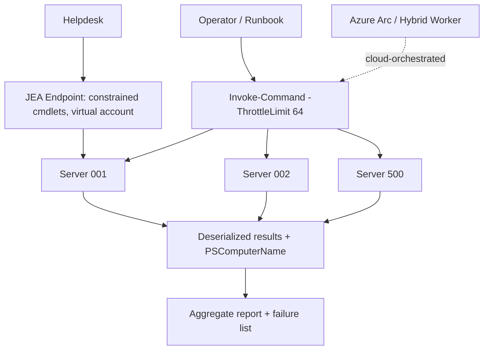

# Ansible and PowerShell Remoting: Fleet Automation at Scale

**Level:** Enterprise
**Tree:** [Scripting Languages](../README.md)
**Branch:** [PowerShell for Operations](README.md)
**Forest:** [Automation & Scripting](../../../README.md)

## Explanation

# PowerShell Remoting and Fleet Operations

PowerShell remoting is the execution fabric for Windows fleet automation. **WinRM**-based remoting (Invoke-Command, Enter-PSSession) authenticates with Kerberos inside a domain; PowerShell 7 adds **SSH-based remoting** for cross-platform and non-domain scenarios. Invoke-Command fans out to many computers concurrently (default ThrottleLimit 32), returning deserialized objects tagged with PSComputerName — the difference between administering 10 servers and 10,000 is largely learning to think in fan-out.

Key mechanics: **sessions** (New-PSSession) persist state across invocations and amortize connection cost; **the double-hop problem** — a remote session cannot forward your credential to a third machine — is solved properly with **resource-based constrained delegation** or CredSSP only as a last resort. Large result sets should be reduced remotely (filter left) before serialization. **JEA (Just Enough Administration)** publishes constrained endpoints: a role capability file whitelists specific cmdlets/parameters, runs under a virtual account, and logs everything — converting broad admin rights into task-scoped delegation, a direct Zero Trust control.

At fleet scale, ad-hoc remoting gives way to orchestration: **Azure Automation hybrid workers**, **Azure Arc** run-command and machine configuration for cloud-managed on-prem servers, or desired-state approaches (DSC v3 / machine configuration) for continuous compliance rather than imperative pushes. Parallelism discipline matters — throttle to what downstream systems (AD, vCenter, APIs) tolerate; add retry with backoff for transient failures; and make every fleet script idempotent so a re-run after partial failure is safe. Always dry-run against a canary group before the full estate.

## Architecture and flow



## Commands

### Command 1

Fan out a query to a server list, capturing unreachable hosts

```text
Invoke-Command -ComputerName (Get-Content servers.txt) -ThrottleLimit 64 -ScriptBlock { Get-Service WinRM | Select-Object Status } -ErrorAction SilentlyContinue -ErrorVariable failed
```

### Command 2

Reuse persistent sessions for multi-step work

```text
New-PSSession -ComputerName web01,web02 -Name Patch | Out-Null; Invoke-Command -Session (Get-PSSession -Name Patch) -ScriptBlock { winget upgrade --all --silent }
```

### Command 3

Define a JEA session configuration for constrained delegation

```text
New-PSSessionConfigurationFile -Path .\Helpdesk.pssc -SessionType RestrictedRemoteServer -RoleDefinitions @{ 'CORP\Helpdesk' = @{ RoleCapabilities = 'ServiceRestart' } } -RunAsVirtualAccount
```

### Command 4

SSH-based remoting from PowerShell 7 to a Linux host

```text
Invoke-Command -HostName linux01 -UserName svc-ops -ScriptBlock { uname -a }
```

## Automation scripts

### Invoke-FleetCheck.ps1

```powershell
# Parallel fleet health check with retry, throttling, and CSV report
[CmdletBinding()]
param(
    [Parameter(Mandatory)][string[]]$ComputerName,
    [int]$ThrottleLimit = 64,
    [int]$RetryCount = 2,
    [string]$ReportPath = "fleet-report.csv"
)
$ErrorActionPreference = 'Stop'
$payload = {
    $os = Get-CimInstance Win32_OperatingSystem
    $disk = Get-CimInstance Win32_LogicalDisk -Filter "DeviceID='C:'"
    [pscustomobject]@{
        LastBoot   = $os.LastBootUpTime
        FreeGB     = [math]::Round($disk.FreeSpace / 1GB, 1)
        PendingReboot = Test-Path 'HKLM:\SOFTWARE\Microsoft\Windows\CurrentVersion\WindowsUpdate\Auto Update\RebootRequired'
    }
}
$results = [System.Collections.Generic.List[object]]::new()
$remaining = $ComputerName
for ($attempt = 0; $attempt -le $RetryCount -and $remaining.Count -gt 0; $attempt++) {
    if ($attempt -gt 0) {
        Write-Warning "Retry $attempt for $($remaining.Count) host(s)"
        Start-Sleep -Seconds (10 * $attempt)
    }
    $failed = @()
    $ok = Invoke-Command -ComputerName $remaining -ScriptBlock $payload -ThrottleLimit $ThrottleLimit -ErrorAction SilentlyContinue -ErrorVariable +failed
    foreach ($r in $ok) { $results.Add($r) }
    $remaining = @($failed | ForEach-Object { $_.TargetObject } | Where-Object { $_ } | Select-Object -Unique)
}
$results | Export-Csv -Path $ReportPath -NoTypeInformation
Write-Host "Collected $($results.Count)/$($ComputerName.Count); unreachable: $($remaining -join ', ')"
if ($remaining.Count -gt 0) { exit 2 }
```

## Lab

**Objective:** Automate a 3-server fleet: parallel health collection, a JEA endpoint for delegated service restarts, and failure handling.

### Steps

1. Enable PS remoting on three lab VMs and verify Kerberos connectivity with Test-WSMan.
2. Run the fleet check script against all three plus one intentionally offline name; review the CSV and exit code.
3. Author a JEA role capability allowing only Restart-Service for a named service and register the endpoint.
4. As a non-admin test user, connect to the JEA endpoint and restart the allowed service; attempt Get-Process and observe denial.
5. Review the JEA transcript directory for the full session log.
6. Demonstrate the double-hop failure from a remote session and fix it with resource-based constrained delegation.

### Validation

CSV contains three rows; script exits 2 flagging the offline host.,JEA session exposes only the whitelisted command (Get-Command count in session is minimal).,Post-delegation, the second hop (remote session accessing a file share) succeeds.

## Operational automation

## From scripts to managed fleet automation

- Move recurring jobs to **Azure Automation / Arc-enabled machine configuration** so scheduling, identity, and logging are platform concerns.
- Canary rings: automation targets ring-0 servers first, gates on success metrics, then proceeds — the same safe-deployment practice as app delivery.
- Publish JEA role capabilities via the internal module feed; endpoint registration itself is DSC/machine-configuration enforced.
- Feed Invoke-Command failure lists into a ticketing webhook automatically for unreachable-host follow-up.

## Troubleshooting

### Scenario 1: Access denied on the second hop (remote session reaching a share or another server)

**Likely cause:** Kerberos double-hop: the remote host has no delegable credential

**Resolution:** Configure resource-based constrained delegation on the target resource for the middle server's computer account; avoid CredSSP except as documented last resort

### Scenario 2: Fan-out job hangs and some servers never return

**Likely cause:** Default timeouts, saturated throttle, or WinRM memory quotas on targets

**Resolution:** Set -OperationTimeout via session options, raise MaxMemoryPerShellMB where legitimate, reduce payload size by filtering remotely, and always capture -ErrorVariable for the failure list

### Scenario 3: Objects returned from remoting are missing methods

**Likely cause:** Results are deserialized property bags, not live objects

**Resolution:** Do method-dependent work inside the remote scriptblock and return plain data (pscustomobject) designed for reporting

## Interview questions

### 1. Explain the double-hop problem and its correct solution.

In a remote session your credential is not forwardable, so the session cannot authenticate to a third machine — access denied on the second hop. The modern fix is resource-based constrained delegation (the resource trusts the middle machine for delegation); CredSSP works but caches credentials on the middle host and is a lateral-movement risk.

### 2. How does JEA implement least privilege for Windows administration?

A JEA endpoint whitelists specific cmdlets, parameters, and even argument patterns in role capability files, runs the session as a transient virtual account (no standing admin identity), maps roles to AD groups, and transcribes everything. Users accomplish the task without ever holding local admin.

### 3. Design an automation to patch-check 5,000 servers safely.

Inventory from CMDB/AD, batch with Invoke-Command at a throttle the environment tolerates, idempotent read-only payload filtered remotely, retries with backoff for transients, ring-based execution starting with canaries, results to a database with unreachable-host ticketing, and the whole thing running as a scheduled runbook under a managed identity — never an interactive admin credential.

### 4. When do you choose SSH remoting over WinRM?

Cross-platform targets (Linux/macOS), non-domain or DMZ machines where Kerberos is unavailable and certificate/key auth is preferable, and mixed estates standardizing on one transport. WinRM/Kerberos remains simplest inside a healthy AD domain and is required for JEA.

## Certification alignment

- AZ-104 - Manage VMs with Run Command and automation
- SC-100 - Privileged access strategy: JEA and delegation design
- Microsoft applied skills: Administer Windows Server hybrid with Arc

## References

- Microsoft Learn: PowerShell remoting over WinRM and SSH
- Microsoft Learn: Just Enough Administration (JEA)
- Microsoft Learn: Kerberos constrained delegation overview

## Suggested video search

PowerShell remoting at scale Invoke-Command JEA double hop explained

---

> Validate commands, versions, permissions, licensing, and rollback procedures in an isolated lab before production use.
