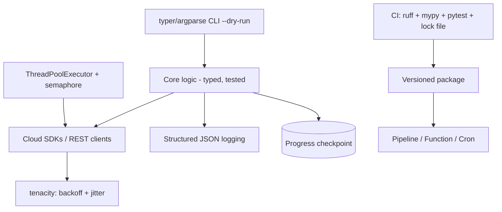

# Python for Infrastructure Automation

**Level:** Intermediate
**Tree:** [Scripting Languages](../README.md)
**Branch:** [Python & Bash for Infrastructure](README.md)
**Forest:** [Automation & Scripting](../../../README.md)

## Explanation

# Python as Infrastructure Glue

Python is the lingua franca of infrastructure tooling: cloud SDKs (azure-sdk, boto3, google-cloud), Kubernetes client, netmiko/nornir for network gear, and every AI/data toolchain. Operations code has different pressures than application code — it runs unattended, touches production, and must fail loudly and safely.

Foundation: isolate every tool in a **virtual environment** with pinned dependencies (uv or pip-tools generating lock files); structure as a proper package with a pyproject.toml entry point, not a loose script; parse arguments with argparse (or typer) including a **--dry-run flag** for anything mutating. Use **logging** (never print) with structured JSON output in pipelines, levels driven by a -v flag, and correlation IDs when orchestrating many resources.

Error handling: catch specific exceptions (ClientError, ApiException) at the point where you can act — retry, skip-and-record, or abort; wrap external calls in **retry with exponential backoff and jitter** (tenacity) because transient cloud API failures are normal, not exceptional; and honor rate limits (respect Retry-After). Long fan-outs should be resumable — record progress so a crash at item 4,000 of 5,000 does not restart from zero.

Concurrency: I/O-bound fan-out (calling 500 device APIs) uses ThreadPoolExecutor or asyncio with a semaphore cap; CPU-bound work uses multiprocessing. **Type hints plus mypy and ruff** in CI catch a large class of bugs before production, and pytest with mocked SDK clients (moto for AWS, responses for HTTP) makes automation testable without touching real infrastructure. Secrets come from the platform (managed identity, Key Vault, environment injection) — never from committed .env files.

## Architecture and flow



## Commands

### Command 1

Create an isolated environment from a locked dependency set

```text
uv venv && uv pip install -r requirements.lock
```

### Command 2

Lint, format-check, and type-check before commit

```text
ruff check . && ruff format --check . && mypy src/
```

### Command 3

Run tests with a coverage gate

```text
pytest -q --cov=src --cov-fail-under=80
```

### Command 4

Run a packaged tool entry point with dry-run and verbose logging

```text
python -m corptool vm-report --subscription prod --dry-run -v
```

## Automation scripts

### tag_enforcer.py

```python
#!/usr/bin/env python3
"""Enforces a required tag on Azure resource groups. Dry-run by default."""
import argparse
import logging
import sys

from azure.core.exceptions import AzureError, HttpResponseError
from azure.identity import DefaultAzureCredential
from azure.mgmt.resource import ResourceManagementClient
from tenacity import retry, stop_after_attempt, wait_exponential

log = logging.getLogger("tag_enforcer")

@retry(stop=stop_after_attempt(4), wait=wait_exponential(multiplier=2, max=30))
def update_tags(client: ResourceManagementClient, rg_name: str, tags: dict) -> None:
    client.resource_groups.update(rg_name, {"tags": tags})

def main() -> int:
    parser = argparse.ArgumentParser(description=__doc__)
    parser.add_argument("--subscription", required=True)
    parser.add_argument("--tag-key", default="costCenter")
    parser.add_argument("--tag-value", default="unassigned")
    parser.add_argument("--apply", action="store_true", help="actually write changes")
    parser.add_argument("-v", "--verbose", action="store_true")
    args = parser.parse_args()
    logging.basicConfig(level=logging.DEBUG if args.verbose else logging.INFO,
                        format="%(asctime)s %(levelname)s %(name)s %(message)s")
    try:
        client = ResourceManagementClient(DefaultAzureCredential(), args.subscription)
        changed = 0
        for rg in client.resource_groups.list():
            tags = dict(rg.tags or {})
            if args.tag_key in tags:
                continue
            tags[args.tag_key] = args.tag_value
            if args.apply:
                try:
                    update_tags(client, rg.name, tags)
                    log.info("tagged rg=%s", rg.name)
                except HttpResponseError as err:
                    log.error("failed rg=%s code=%s", rg.name, err.status_code)
                    continue
            else:
                log.info("DRY-RUN would tag rg=%s", rg.name)
            changed += 1
        log.info("complete: %d group(s) %s", changed, "updated" if args.apply else "pending")
        return 0
    except AzureError as err:
        log.error("Azure failure: %s", err)
        return 1

if __name__ == "__main__":
    sys.exit(main())
```

## Lab

**Objective:** Package a resumable, dry-run-capable Azure tagging tool with tests and CI-grade checks.

### Steps

1. Scaffold a package with pyproject.toml, src layout, and a console entry point.
2. Implement the tag enforcer with dry-run default, tenacity retries, and JSON logging option.
3. Add pytest tests mocking ResourceManagementClient, covering dry-run, apply, and API-error paths.
4. Add ruff and mypy configs; make everything pass.
5. Run against a sandbox subscription in dry-run, review output, then run with --apply.
6. Kill the run mid-way and re-run to confirm idempotency (already-tagged groups skipped).

### Validation

pytest passes with coverage over 80%; mypy and ruff report clean.,Dry-run output lists exactly the untagged groups; --apply adds tags visible in the portal.,Second run reports zero pending changes, proving idempotency.

## Operational automation

## Operationalizing Python tools

- Distribute via an internal package index; pipelines install pinned versions, never copy scripts.
- Run as **Azure Functions (timer) / Lambda / Kubernetes CronJobs** with managed identity — no credentials in code or config.
- Emit structured logs to the central platform; alert on non-zero exits and error-level events.
- Wrap the tool as a self-service action (n8n node, backstage action, pipeline template) so teams consume it without shell access.

## Troubleshooting

### Scenario 1: Tool hammered by 429 Too Many Requests and fails mid-fan-out

**Likely cause:** No rate limiting or backoff against the cloud API

**Resolution:** Add tenacity retry honoring Retry-After, cap concurrency with a semaphore, and batch requests where the API supports it

### Scenario 2: Works on the author's laptop, crashes in the pipeline with ImportError or version conflicts

**Likely cause:** Unpinned dependencies and reliance on globally installed packages

**Resolution:** Commit a lock file, build in a clean container in CI, and ship the tool as a versioned package with declared dependencies

### Scenario 3: Silent partial failure — some resources skipped without trace

**Likely cause:** Broad except blocks swallowing exceptions inside the loop

**Resolution:** Catch narrowly, log every skip with the resource identity and reason, count failures, and reflect them in the exit code

## Interview questions

### 1. How does infrastructure Python differ from application Python?

It runs unattended against production, so the priorities are: dry-run modes and idempotency, loud structured failure signals, retries with backoff for the normal background rate of API errors, resumability for long fan-outs, and platform-sourced credentials. Elegance matters less than operational safety and observability.

### 2. Threading, asyncio, or multiprocessing for automation workloads?

Most automation is I/O-bound (waiting on APIs): ThreadPoolExecutor is the simplest fit; asyncio scales further and suits SDKs with async support, with a semaphore to respect rate limits. Multiprocessing is for CPU-bound work like parsing gigabytes of logs. Measure before choosing complexity.

### 3. How do you test code whose job is to mutate cloud resources?

Separate decision logic from side effects; unit-test logic with mocked SDK clients (moto, responses, or hand-rolled fakes) asserting intended calls; integration-test against a sandbox subscription in CI on a schedule; and always ship a dry-run mode — which doubles as the reviewer's evidence.

### 4. What belongs in CI for an internal Python tool?

Lock-file-based clean build, ruff lint/format, mypy, pytest with coverage gate, secret scanning, dependency vulnerability audit (pip-audit/osv), package build, and publish on tag — the same supply-chain discipline as customer-facing software, because this code holds production credentials.

## Certification alignment

- AZ-400 - Implement automation with Python-based tooling in pipelines
- AWS SAA-C03 - supporting knowledge: SDK/boto3 automation patterns
- CKA - supporting knowledge: Kubernetes Python client operations

## References

- Azure SDK for Python documentation and DefaultAzureCredential guidance
- tenacity documentation - retry patterns
- boto3 documentation and moto testing library

## Suggested video search

Python infrastructure automation boto3 azure sdk retry logging best practices

---

> Validate commands, versions, permissions, licensing, and rollback procedures in an isolated lab before production use.
