# Certificate Lifecycle Automation Expiry Scanning and Renewal Across the Estate

**Level:** Advanced
**Tree:** [Estate Tooling and Certificate Lifecycle](../README.md)
**Branch:** [Inherited Tooling and Expiry Management](README.md)
**Forest:** [Automation & Scripting](../../../README.md)

## Explanation

# Certificate Lifecycle Automation

Certificate expiry is the outage that is fully predictable and still happens. Every certificate announces its own death date at issue, and estates still fall over — which makes this a process failure rather than a technical one.

## Why it keeps happening

**Nobody owns the population.** Individual certificates have owners; the estate has none. A certificate installed for a project three years ago outlives the project, the team and the documentation.

**Discovery is harder than renewal.** Renewing a known certificate is a solved problem. Finding every certificate is not — they sit on load balancers, in application keystores, on appliances, inside container images, in code signing pipelines and in places nobody put in a register.

**Alerting fires into an unattended mailbox.** Most estates have expiry alerting. It goes to a distribution list whose members have changed, so it is technically working and functionally absent.

## Discovery has to be active, not declared

A register maintained by hand records what someone remembered to add. **Scanning finds what is actually presented.**

**Scan by endpoint, not by inventory.** Connect to every listening TLS port across the estate and read the certificate served. This finds the ones no register knows about, which are exactly the ones that cause outages.

**Certificate Transparency logs find what your scan cannot reach** — anything issued for your domains by any public CA, including certificates a team obtained without telling anyone. This regularly surfaces shadow IT and it costs nothing to check.

**Internal PKI needs its own query.** An AD CS estate holds the authoritative list of what it issued, and templates predict what will renew automatically and what will not.

## Automatic renewal changes the failure mode rather than removing it

**ACME automation** — renewal without human involvement, which is the right default. It moves the risk from *did anyone remember* to *does the renewal path still work*, and a silently broken renewal path is discovered at expiry.

**Auto-enrolment in AD CS** does the same for domain-joined machines and leaves everything else — appliances, Linux hosts outside the domain, third-party services — on the manual path.

**The thing that actually breaks: renewal succeeds and deployment does not.** A new certificate is issued and the service keeps presenting the old one because nothing reloaded it. Renewal automation without a reload step produces a valid certificate on disk and an expired one on the wire.

## Short lifetimes make this non-negotiable

Public certificate lifetimes have been falling for years and are heading toward weeks. **At 47 days, manual renewal is not a viable process** for any estate — the industry is deliberately forcing automation, and an estate that cannot renew automatically will be the one that finds out.

## Measure exposure, not compliance

**Days to nearest expiry, per owner** is the number worth watching. A count of valid certificates says nothing about the one expiring on Friday.

**Certificates with no owner** is the second: an unowned certificate cannot be renewed by anyone in particular, and that is the true risk register.

## Architecture and flow

```mermaid
flowchart TD
    C["Expiry is the fully predictable outage that still happens"] --> C1["Every certificate announces its death date at issue"]
    C1 --> C2["So this is a PROCESS failure, not a technical one"]
    W["Why it keeps happening"] --> W1["NOBODY OWNS THE POPULATION"]
    W1 --> W2["Individual certs have owners; the estate has none"]
    W2 --> W3["A cert outlives the project, the team and the documentation"]
    W --> W4["DISCOVERY is harder than renewal"]
    W4 --> W5["Renewing a known cert is solved"]
    W4 --> W6["Finding every cert is not"]
    W6 --> W7["Load balancers · keystores · appliances · images · signing pipelines"]
    W --> W8["Alerting fires into an UNATTENDED MAILBOX"]
    W8 --> W9["Distribution list whose members changed"]
    W9 --> W10["Technically working, functionally absent"]
    D{"Discovery must be ACTIVE, not declared"} --> D1["A hand-maintained register records what someone remembered"]
    D --> D2["SCANNING finds what is actually presented"]
    D2 --> D3["Scan by ENDPOINT, not by inventory"]
    D3 --> D4["Connect to every listening TLS port, read what is served"]
    D4 --> D5["Finds the ones no register knows about"]
    D5 --> D6["...exactly the ones that cause outages"]
    D --> D7["CERTIFICATE TRANSPARENCY logs"]
    D7 --> D8["Anything issued for your domains by any public CA"]
    D8 --> D9["Including certs a team obtained without telling anyone"]
    D9 --> D10["Regularly surfaces shadow IT, costs nothing"]
    D --> D11["Internal PKI needs its own query"]
    D11 --> D12["AD CS holds what it issued; templates predict what auto-renews"]
    A["Automatic renewal CHANGES the failure mode"] --> A1["ACME - renewal with no human involvement"]
    A1 --> A2["Right default"]
    A2 --> A3["Risk moves from 'did anyone remember'"]
    A3 --> A4["to 'does the renewal path still work'"]
    A4 --> A5["A silently broken path is discovered AT EXPIRY"]
    A --> A6["AD CS auto-enrolment covers domain-joined machines"]
    A6 --> A7["Leaves appliances, non-domain Linux, third parties manual"]
    F{"What actually breaks"} --> F1["RENEWAL SUCCEEDS AND DEPLOYMENT DOES NOT"]
    F1 --> F2["New cert issued, service still presents the old one"]
    F2 --> F3["Nothing reloaded it"]
    F3 --> F4["Valid cert on disk, expired cert on the wire"]
    S["Short lifetimes make this non-negotiable"] --> S1["Public lifetimes falling toward weeks"]
    S1 --> S2["At 47 days manual renewal is not a viable process"]
    S2 --> S3["The industry is deliberately forcing automation"]
    M["Measure EXPOSURE, not compliance"] --> M1["Days to nearest expiry, PER OWNER"]
    M1 --> M2["A count of valid certs says nothing about Friday"]
    M --> M3["Certificates with NO OWNER"]
    M3 --> M4["Cannot be renewed by anyone in particular"]
    M4 --> M5["That is the true risk register"]
```



## Commands

### Command 1

Read the certificate actually presented on the wire, which is the only authoritative source — a register records what someone remembered

```text
echo | openssl s_client -connect example.com:443 -servername example.com 2>/dev/null | openssl x509 -noout -enddate -subject
```

### Command 2

Sweep a subnet for TLS endpoints, finding certificates no inventory knows about

```text
nmap -p 443,8443,993,995,465 --script ssl-cert 10.0.0.0/24 -oG - 2>/dev/null | grep -c "Ports:"
```

### Command 3

Query Certificate Transparency for everything issued for your domains, including certificates obtained without telling anyone

```text
curl -sS "https://crt.sh/?q=%25.example.com&output=json" | jq -r ".[] | [.not_after,.common_name,.issuer_name] | @tsv" | sort | head
```

### Command 4

List AD CS certificates expiring within 30 days with their template, since the template predicts whether renewal is automatic

```text
certutil -view -restrict "NotAfter<=now+30:days,Disposition=20" -out "CommonName,NotAfter,Template" 2>nul
```

### Command 5

Confirm ACME renewal is configured and that its timer is actually scheduled — a broken renewal path is discovered at expiry

```text
certbot certificates 2>/dev/null | grep -E "Certificate Name|Expiry Date"; systemctl list-timers certbot* --no-pager
```

### Command 6

Exercise the renewal path without waiting for expiry, which is the only way to find it broken in advance

```text
certbot renew --dry-run 2>&1 | tail -5
```

### Command 7

Flag on-disk certificates expiring within 30 days, then compare against what the service is actually serving

```text
for f in /etc/ssl/certs/*.pem; do openssl x509 -in "$f" -noout -checkend 2592000 >/dev/null || echo "EXPIRING: $f"; done
```

## Automation scripts

### certificate-estate-exposure.py

```python
#!/usr/bin/env python3
"""Reports certificate estate EXPOSURE rather than compliance, and deliberately refuses to
print a count of valid certificates.

A count of valid certificates says nothing about the one expiring on Friday. The numbers that
matter are:

  DAYS TO NEAREST EXPIRY, PER OWNER   the actual exposure, attributable to someone
  CERTIFICATES WITH NO OWNER          an unowned certificate cannot be renewed by anyone in
                                      particular, which is the true risk register
  ON-DISK vs ON-THE-WIRE MISMATCH     the failure that actually causes outages in automated
                                      estates: renewal SUCCEEDS and deployment does not, so a
                                      valid certificate sits on disk while the service keeps
                                      presenting the expired one because nothing reloaded it

Input CSV:
    host,port,owner,not_after_wire,not_after_disk,auto_renew,source
    api.example.com,443,payments,2026-09-01,2026-11-30,acme,scan
    legacy.example.com,443,,2026-08-20,,none,ct-log

Usage:
    python3 certificate-estate-exposure.py certs.csv --today 2026-08-06
"""
import argparse
import csv
import sys
from collections import defaultdict
from datetime import datetime


def pdate(v):
    v = (v or "").strip()
    if not v:
        return None
    try:
        return datetime.strptime(v[:10], "%Y-%m-%d").date()
    except ValueError:
        return None


def main():
    ap = argparse.ArgumentParser(description=__doc__,
                                 formatter_class=argparse.RawDescriptionHelpFormatter)
    ap.add_argument("csvfile")
    ap.add_argument("--today", required=True, help="YYYY-MM-DD, passed in explicitly")
    args = ap.parse_args()

    today = pdate(args.today)
    if not today:
        print("error: --today must be YYYY-MM-DD", file=sys.stderr)
        return 1
    try:
        with open(args.csvfile, newline="", encoding="utf-8") as fh:
            rows = list(csv.DictReader(fh))
    except OSError as exc:
        print("error: %s" % exc, file=sys.stderr)
        return 1
    if not rows:
        print("error: no certificates listed", file=sys.stderr)
        return 1

    by_owner = defaultdict(list)
    unowned, mismatched, no_auto = [], [], []

    for r in rows:
        host = "%s:%s" % ((r.get("host") or "?").strip(), (r.get("port") or "?").strip())
        owner = (r.get("owner") or "").strip()
        wire = pdate(r.get("not_after_wire"))
        disk = pdate(r.get("not_after_disk"))
        auto = (r.get("auto_renew") or "none").strip().lower()
        src = (r.get("source") or "?").strip()

        if not wire:
            continue
        days = (wire - today).days
        entry = (days, host, owner or "UNOWNED", auto, src)

        if owner:
            by_owner[owner].append(entry)
        else:
            unowned.append(entry)

        if disk and wire and disk > wire:
            mismatched.append((host, wire, disk, (disk - wire).days))
        if auto in ("none", "manual", ""):
            no_auto.append(entry)

    print("EXPOSURE BY OWNER — days to nearest expiry")
    worst = []
    for owner in sorted(by_owner):
        items = sorted(by_owner[owner])
        nearest = items[0]
        worst.append((nearest[0], owner))
        flag = "  <-- EXPIRED" if nearest[0] < 0 else ("  <-- under 14 days" if nearest[0] < 14 else "")
        print("  %-22s %4d days   %s%s" % (owner[:22], nearest[0], nearest[1], flag))

    exit_code = 0
    if worst and min(worst)[0] < 14:
        exit_code = 1

    if unowned:
        print("\nCERTIFICATES WITH NO OWNER (%d) — the true risk register" % len(unowned))
        for days, host, _o, auto, src in sorted(unowned)[:15]:
            print("  %4d days  %-38s auto=%-6s found via %s" % (days, host[:38], auto, src))
        print("  An unowned certificate cannot be renewed by anyone in particular. Individual")
        print("  certificates have owners; the estate usually has none, and a certificate")
        print("  outlives the project, the team and the documentation that created it.")
        exit_code = 1

    if mismatched:
        print("\nRENEWED BUT NOT DEPLOYED (%d) — disk is newer than the wire" % len(mismatched))
        for host, wire, disk, gap in mismatched:
            print("  %-38s wire %s  disk %s  (%d days newer)" % (host[:38], wire, disk, gap))
        print("  This is what actually breaks in automated estates: renewal SUCCEEDED and")
        print("  deployment did not. The service keeps presenting the old certificate because")
        print("  nothing reloaded it - a valid certificate on disk and an expired one on the")
        print("  wire. Renewal automation without a reload step produces exactly this.")
        exit_code = 1

    if no_auto:
        print("\nNO AUTOMATIC RENEWAL (%d)" % len(no_auto))
        for days, host, owner, _a, _s in sorted(no_auto)[:12]:
            print("  %4d days  %-34s %s" % (days, host[:34], owner))
        print("  Public certificate lifetimes are falling toward weeks. At 47 days manual")
        print("  renewal is not a viable process for any estate - the industry is deliberately")
        print("  forcing automation, and an estate that cannot renew automatically is the one")
        print("  that will find out.")

    print("\nDeliberately not reported: a count of valid certificates. It is the number that")
    print("looks best and tells you least.")
    return exit_code


if __name__ == "__main__":
    sys.exit(main())
```

## Lab

**Objective:** Demonstrate that active discovery finds what a register does not, and produce the renewed-but-not-deployed failure deliberately.

### Steps

1. Build a register of known certificates for a test estate.
2. Scan every listening TLS port across the estate and read what is actually served.
3. Compare the scan against the register and list what only the scan found.
4. Query Certificate Transparency for the domain and compare again.
5. Configure ACME renewal for one service and confirm the timer is scheduled.
6. Run a renewal dry run and confirm the path works before it is needed.
7. Renew a certificate without reloading the service.
8. Compare the certificate on disk with the certificate presented on the wire.
9. Break the renewal path deliberately and observe that nothing reports it until expiry approaches.
10. Produce an exposure report by owner and identify every certificate with no owner.

### Validation

The endpoint scan finds certificates absent from the register.,Certificate Transparency surfaces at least one certificate the internal scan could not reach.,After renewal without a reload, disk and wire disagree and the service still serves the old certificate.,A broken renewal path produces no signal until expiry, confirming why dry runs are required.

## Operational automation

## Automating the certificate estate

**Scan endpoints on a schedule rather than maintaining a register.** A register records what someone remembered to add; a scan records what is actually presented, and the gap between them is where outages live.

**Query Certificate Transparency for your own domains.** It finds certificates issued by any public CA including ones obtained without telling anyone, and it costs nothing.

**Exercise the renewal path with a dry run on a schedule.** Automatic renewal moves the risk from *did anyone remember* to *does the path still work*, and a silently broken path is otherwise discovered at expiry.

**Compare disk against wire after every renewal.** Renewal automation without a reload step produces a valid certificate on disk and an expired one in service — the failure mode automation introduces rather than removes.

**Report days-to-nearest-expiry per owner, and never a count of valid certificates.** The count is the number that looks best and tells you least.

## Troubleshooting

### Scenario 1: A certificate expired despite alerting being in place

**Likely cause:** The alert went to a distribution list whose membership changed — technically working, functionally absent

**Resolution:** Route expiry alerts to an owner who exists today and test the route, not just the alert

### Scenario 2: A service serves an expired certificate although renewal succeeded

**Likely cause:** Renewal wrote a new certificate to disk and nothing reloaded the service

**Resolution:** Add a reload step to the renewal hook and verify by comparing disk against the wire

### Scenario 3: An outage was caused by a certificate nobody knew existed

**Likely cause:** Discovery relied on a hand-maintained register, which records only what someone remembered to add

**Resolution:** Scan endpoints actively and cross-check Certificate Transparency for anything issued externally

### Scenario 4: ACME renewal silently stopped working months ago

**Likely cause:** Automation moved the risk from remembering to whether the path still works, and nothing exercised it

**Resolution:** Run scheduled renewal dry runs so a broken path is found before expiry rather than at it

### Scenario 5: Domain-joined machines renew automatically and appliances do not

**Likely cause:** AD CS auto-enrolment covers domain members only, leaving appliances, non-domain Linux and third parties manual

**Resolution:** Identify the non-enrolled population explicitly; it is the part that will expire

### Scenario 6: A certificate cannot be renewed because nobody will claim it

**Likely cause:** It has no owner — individual certificates have owners while the estate has none

**Resolution:** Treat unowned certificates as the risk register and assign ownership before expiry forces the question

## Interview questions

### 1. Why does certificate expiry still cause outages?

Because it is a process failure rather than a technical one, and the technical part has been solved for years. Every certificate announces its own death date at issue, so there is no surprise available — and estates still fall over. Three reasons recur. Nobody owns the population: individual certificates have owners, the estate has none, and a certificate installed for a project three years ago outlives the project, the team and the documentation. Discovery is harder than renewal — renewing a known certificate is trivial, finding every certificate is not, because they sit on load balancers, in application keystores, on appliances, inside container images and in code signing pipelines. And the alerting usually exists but fires into a distribution list whose members have all changed, so it is technically working and functionally absent.

### 2. How would you discover the certificate estate?

Actively, not by register. A hand-maintained register records what someone remembered to add; scanning records what is actually presented, and the gap between the two is precisely where outages come from. So I would scan by endpoint rather than by inventory — connect to every listening TLS port and read the certificate served — because that finds the ones no register knows about. Then I would query Certificate Transparency for the organisation domains, which finds anything issued by any public CA including certificates a team obtained without telling anyone; it regularly surfaces shadow IT and costs nothing to check. And internal PKI needs its own query, because an AD CS estate holds the authoritative list of what it issued and the certificate template tells you which of those will renew automatically and which will not.

### 3. Does automatic renewal solve the problem?

It changes the failure mode rather than removing it, and that distinction matters. ACME-style renewal takes the human out, which is the right default — but the risk moves from *did anyone remember* to *does the renewal path still work*, and a silently broken renewal path is discovered at expiry, which is the worst possible time. So I would run scheduled dry runs to exercise the path before it is needed. The failure that actually bites automated estates, though, is different: renewal succeeds and deployment does not. A new certificate is issued and written to disk, and the service keeps presenting the old one because nothing reloaded it — a valid certificate on disk and an expired one on the wire. Renewal automation without a reload step produces exactly that, and it looks like success in every log.

### 4. What would you measure?

Days to nearest expiry per owner, and the count of certificates with no owner. What I would refuse to report is a count of valid certificates, because it is the number that looks best and tells you least — it says nothing whatsoever about the one expiring on Friday. The unowned count is the real risk register: an unowned certificate cannot be renewed by anyone in particular, so it is guaranteed to be handled late or not at all. I would add the disk-versus-wire comparison as a standing check for the reload failure. And this is all getting more urgent rather than less, because public certificate lifetimes have been falling for years and are heading toward weeks — at 47 days, manual renewal simply is not a viable process for any estate, which is the industry deliberately forcing automation.

## Certification alignment

- CompTIA Security+ — PKI and certificate management
- Microsoft AZ-800 — AD CS and certificate services
- (ISC)2 CISSP — cryptography and key lifecycle
- GIAC GSEC — practical PKI operations

## References

- CA/Browser Forum baseline requirements: certificate lifetime reductions
- RFC 8555 — Automatic Certificate Management Environment (ACME)
- Certificate Transparency (RFC 6962) and crt.sh
- Microsoft AD CS auto-enrolment and certificate templates

## Suggested video search

certificate lifecycle expiry scanning ACME automatic renewal certificate transparency AD CS auto-enrolment reload after renewal 47 day lifetime TLS estate discovery

---

> Validate commands, versions, permissions, licensing, and rollback procedures in an isolated lab before production use.
