# Configuration Management Tool Landscape Chef Puppet Salt and OpenTofu Migration

**Level:** Advanced
**Tree:** [Estate Tooling and Certificate Lifecycle](../README.md)
**Branch:** [Inherited Tooling and Expiry Management](README.md)
**Forest:** [Automation & Scripting](../../../README.md)

## Explanation

# The Configuration Management Landscape

Most automation work happens in an estate that already runs something. Knowing only the tool you would choose is what produces the recommendation to replace everything, which is almost never the right answer.

## The architectural split that predicts behaviour

**Agentless, push** — Ansible. Connects over SSH or WinRM and runs. Nothing to install on targets, which is why it spreads fastest; the trade is that the control node must reach every target and orchestration is your problem at scale.

**Agent, pull** — Puppet, Chef, Salt in its usual mode. The node checks in, fetches its catalogue, converges, and reports. This survives a control-plane outage better and enforces continuously rather than only when someone runs a playbook — **the drift story is genuinely stronger**. The cost is an agent to install, upgrade and secure on every node.

That one axis predicts most of what you will experience. **A pull agent converges when you are not looking; a push tool converges when you run it**, and an estate that has quietly diverged for six months behaves very differently under each.

## What each is actually strong at

**Puppet** — declarative, with a mature model of resource relationships and dependency ordering. Strongest where compliance requires *continuous* enforcement rather than periodic runs. Its own DSL is a real learning cost.

**Chef** — Ruby. Full programming language power, which is genuinely useful for complex logic and genuinely dangerous because recipes become software that needs testing like software.

**SaltStack** — a fast message bus, so it is the strongest of the four at *remote execution across thousands of nodes right now*, as distinct from convergence. Estates often keep Salt for orchestration after moving configuration elsewhere.

**OpenTofu** — not in the same category and constantly compared anyway. It is a **Terraform fork under the Linux Foundation**, created after HashiCorp's licence change to BSL. Infrastructure provisioning, not configuration management. Migrating from Terraform is deliberately near-drop-in, and the reason to do it is licensing rather than capability.

## Provisioning and configuration are different jobs

The most common architectural error here is using one tool for both. **Terraform or OpenTofu creates the machine; Ansible or Puppet decides what is on it.** Provisioning tools model desired infrastructure state and are poor at ongoing in-guest configuration; configuration tools are poor at managing cloud resource graphs and dependency ordering.

Estates that force one tool to do both end up with configuration expressed as provisioning side effects, which breaks the moment anything is changed outside the tool.

## Migrating between them

**Do not port module for module.** Inherited configuration encodes years of accumulated fixes, and much of it is dead — targeting an OS version no longer running, or a workaround for a bug fixed long ago. A port carries all of it into the new tool and doubles the cost of understanding it.

**Run both during transition, with clear ownership per resource.** Two tools managing one file is a fight that will be won by whichever ran last, intermittently.

**The migration cost is rarely the code.** It is the pipeline, the secrets integration, the testing approach and the team's fluency — and those are what actually determine whether the new tool is used well.

## Architecture and flow

```mermaid
flowchart TD
    E["Most automation happens in an estate already running something"] --> E1["Knowing only your preferred tool"]
    E1 --> E2["produces 'replace everything'"]
    E2 --> E3["...almost never the right answer"]
    A{"The axis that predicts behaviour"} --> P1["AGENTLESS, PUSH - Ansible"]
    P1 --> P2["SSH or WinRM, nothing installed on targets"]
    P2 --> P3["Spreads fastest"]
    P1 --> P4["Control node must reach every target"]
    P4 --> P5["Orchestration is your problem at scale"]
    A --> G1["AGENT, PULL - Puppet · Chef · Salt"]
    G1 --> G2["Node checks in, fetches catalogue, converges, reports"]
    G2 --> G3["Survives a control-plane outage"]
    G2 --> G4["Enforces CONTINUOUSLY, not only when someone runs it"]
    G4 --> G5["The drift story is genuinely stronger"]
    G1 --> G6["Cost: an agent to install, upgrade and secure everywhere"]
    A --> K["A pull agent converges WHEN YOU ARE NOT LOOKING"]
    A --> K2["A push tool converges WHEN YOU RUN IT"]
    K2 --> K3["Six months of quiet divergence behaves very differently under each"]
    S["What each is strong at"] --> S1["PUPPET - declarative, mature resource relationships"]
    S1 --> S2["Best where compliance needs CONTINUOUS enforcement"]
    S1 --> S3["Its own DSL is a real learning cost"]
    S --> S4["CHEF - Ruby, full language power"]
    S4 --> S5["Useful for complex logic"]
    S4 --> S6["Dangerous: recipes become software needing tests"]
    S --> S7["SALTSTACK - fast message bus"]
    S7 --> S8["Strongest at REMOTE EXECUTION across thousands of nodes now"]
    S8 --> S9["As distinct from convergence"]
    S9 --> S10["Estates keep Salt for orchestration after moving config elsewhere"]
    S --> S11["OPENTOFU - not the same category, compared anyway"]
    S11 --> S12["A Terraform fork under the Linux Foundation"]
    S12 --> S13["Created after the BSL licence change"]
    S13 --> S14["Reason to move is LICENSING, not capability"]
    D{"Provisioning and configuration are different jobs"} --> D1["Terraform/OpenTofu CREATES the machine"]
    D --> D2["Ansible/Puppet decides WHAT IS ON IT"]
    D --> D3["Forcing one tool to do both"]
    D3 --> D4["= configuration expressed as provisioning side effects"]
    D4 --> D5["Breaks the moment anything changes outside the tool"]
    M["Migrating between them"] --> M1["DO NOT PORT MODULE FOR MODULE"]
    M1 --> M2["Inherited config encodes years of fixes"]
    M2 --> M3["Much of it is dead - old OS versions, bugs long fixed"]
    M3 --> M4["A port carries all of it across"]
    M --> M5["Run both, with clear ownership PER RESOURCE"]
    M5 --> M6["Two tools on one file = whichever ran last wins, intermittently"]
    M --> M7["The cost is rarely the code"]
    M7 --> M8["Pipeline · secrets · testing · team fluency"]
    M8 --> M9["Those decide whether the new tool is used well"]
```



## Commands

### Command 1

Run a Puppet catalogue without applying it — exit 2 means changes are pending, which is how drift is measured before it is corrected

```text
puppet agent --test --noop --detailed-exitcodes; echo "exit=$?"
```

### Command 2

Chef dry run showing what would converge, the equivalent check for a Chef-managed estate

```text
chef-client --why-run 2>&1 | grep -E "would (update|create|remove)" | head
```

### Command 3

Count Salt minions that are not responding, since remote execution is what Salt is usually retained for

```text
salt "*" test.ping --output=json | jq "to_entries | map(select(.value == false)) | length"
```

### Command 4

Push-model check run, which converges only when invoked — the contrast with a pull agent that converges unattended

```text
ansible all -i inventory --check --diff -m setup 2>&1 | tail -5
```

### Command 5

Migrate Terraform state to OpenTofu and confirm a clean plan; exit 0 means the fork is a genuine drop-in for this configuration

```text
tofu init -migrate-state && tofu plan -detailed-exitcode; echo "exit=$?"
```

### Command 6

Find modules targeting operating systems no longer running, which is the dead configuration a module-for-module port would carry across

```text
grep -rlE "ubuntu-1[46]|centos-[67]|el6" /etc/puppetlabs/code/environments/production/modules/ 2>/dev/null | head
```

### Command 7

Inspect what each tool believes it owns on a node, which is how a two-tool overlap is found before it causes an intermittent fight

```text
puppet resource service --to_yaml 2>/dev/null | head -20; salt-call --local state.show_top 2>/dev/null | head
```

## Automation scripts

### find-config-tool-overlap.py

```python
#!/usr/bin/env python3
"""Finds resources claimed by more than one configuration management tool, which is the
failure that produces 'this file keeps changing back' and is almost impossible to catch by
reading either tool's code alone.

Two tools managing one file is a fight won by whichever ran last - so the symptom is
INTERMITTENT, and it correlates with run schedules rather than with deployments. That is why
it survives so long: every investigation starts by looking at the change that was deployed.

The underlying architectural point: a PULL agent (Puppet, Chef, Salt) converges when you are
not looking, and a PUSH tool (Ansible) converges when you run it. During a migration both are
usually live, so overlap is not an edge case - it is the default state unless ownership was
assigned per resource up front.

Input CSV, one row per managed resource:
    node,resource,tool,last_run
    web01,/etc/nginx/nginx.conf,puppet,2026-08-06T02:00
    web01,/etc/nginx/nginx.conf,ansible,2026-08-06T09:15

Usage:
    python3 find-config-tool-overlap.py managed.csv
"""
import csv
import sys
from collections import defaultdict

PULL = {"puppet", "chef", "salt", "saltstack"}
PUSH = {"ansible"}


def main(argv):
    if len(argv) != 2:
        print(__doc__)
        return 2
    try:
        with open(argv[1], newline="", encoding="utf-8") as fh:
            rows = list(csv.DictReader(fh))
    except OSError as exc:
        print("error: %s" % exc, file=sys.stderr)
        return 1
    if not rows:
        print("error: nothing listed", file=sys.stderr)
        return 1

    owners = defaultdict(dict)
    tools = set()
    for r in rows:
        node = (r.get("node") or "?").strip()
        res = (r.get("resource") or "?").strip()
        tool = (r.get("tool") or "?").strip().lower()
        tools.add(tool)
        owners[(node, res)][tool] = (r.get("last_run") or "").strip()

    contested = {k: v for k, v in owners.items() if len(v) > 1}

    print("MANAGED RESOURCES: %d   TOOLS IN PLAY: %s"
          % (len(owners), ", ".join(sorted(tools))))

    if not contested:
        print("\nNo resource is claimed by more than one tool.")
    else:
        print("\nCONTESTED RESOURCES (%d) — claimed by more than one tool" % len(contested))
        for (node, res), claims in sorted(contested.items()):
            order = sorted(claims.items(), key=lambda kv: kv[1] or "")
            winner = order[-1][0] if order[-1][1] else "unknown"
            print("\n  %s : %s" % (node, res))
            for tool, when in order:
                print("      %-10s last run %s" % (tool, when or "unknown"))
            print("      -> currently won by %s. This flips whenever run order flips, so the"
                  % winner)
            print("         symptom is intermittent and correlates with SCHEDULES, not with")
            print("         deployments - which is why it survives investigation.")

            has_pull = any(t in PULL for t in claims)
            has_push = any(t in PUSH for t in claims)
            if has_pull and has_push:
                print("         A pull agent and a push tool both claim this. The pull agent")
                print("         will reassert unattended, so the push tool appears to 'lose'")
                print("         changes hours after a successful run.")

    print("\nASSIGN OWNERSHIP PER RESOURCE, not per tool. During a migration both tools are")
    print("live by design, so overlap is the default state unless someone decided otherwise.")
    print("\nAnd when porting: do NOT go module for module. Inherited configuration encodes")
    print("years of accumulated fixes and much of it is dead - targeting an OS no longer")
    print("running, or working around a bug fixed long ago. A faithful port carries all of it")
    print("into the new tool and doubles the cost of ever understanding it.")
    return 1 if contested else 0


if __name__ == "__main__":
    sys.exit(main(sys.argv))
```

## Lab

**Objective:** Demonstrate the practical difference between pull and push convergence, and produce the two-tool overlap failure deliberately.

### Steps

1. Configure a node under a pull agent managing a specific file.
2. Change the file by hand and wait for the agent interval without running anything.
3. Record whether and when the change was reverted.
4. Configure the same file under a push tool and repeat the hand edit.
5. Record that nothing reverts until the tool is run.
6. Place both tools on the same file with different desired content.
7. Run the push tool, then wait for the pull agent interval.
8. Record which content survives and correlate it with run order rather than with the edit.
9. Migrate a Terraform configuration to OpenTofu and confirm a clean plan.
10. Search the inherited configuration for modules targeting operating systems no longer in the estate.

### Validation

The pull agent reverts the change unattended; the push tool does not.,The contested file flips content according to run order, intermittently.,OpenTofu produces a zero-change plan against migrated state.,Dead configuration targeting retired operating systems is identified before any port.

## Operational automation

## Automating an inherited estate

**Report drift as a count of pending changes, not as a pass or fail.** A no-op run with detailed exit codes tells you how far the estate has moved without correcting it, which is the measurement you need before deciding whether continuous enforcement is worth its cost.

**Detect two-tool overlap continuously during any migration.** Overlap is the default state while both tools are live, and its symptom is intermittent and correlates with schedules rather than with deployments.

**Inventory dead configuration before porting anything.** Modules targeting retired operating systems are the clearest signal, and a faithful port carries them into the new tool.

**Verify an OpenTofu migration by a zero-change plan**, not by a successful init — init proves the state was read, and the plan proves nothing moved.

## Troubleshooting

### Scenario 1: A configuration file keeps reverting to unwanted content

**Likely cause:** Two tools claim the same resource and the outcome is decided by whichever ran last

**Resolution:** Assign ownership per resource rather than per tool; during migration both are live by design

### Scenario 2: A push tool run succeeds and the change disappears hours later

**Likely cause:** A pull agent also manages the resource and reasserts unattended

**Resolution:** Exclude the resource from the pull agent, or manage it exclusively there — a pull agent converges when nobody is looking

### Scenario 3: Drift accumulates for months without anyone noticing

**Likely cause:** A push-only model converges only when invoked, so nothing enforces between runs

**Resolution:** Either schedule runs as enforcement or adopt continuous enforcement where compliance requires it

### Scenario 4: A migration ported cleanly and behaviour still changed

**Likely cause:** The inherited configuration contained workarounds whose purpose was undocumented, and porting preserved the code without the context

**Resolution:** Re-derive intent rather than porting module for module; much inherited configuration is dead

### Scenario 5: Cloud resources drift and the configuration tool does not correct them

**Likely cause:** A configuration management tool is being used for provisioning, which it models poorly

**Resolution:** Separate the jobs — provisioning creates the machine, configuration decides what is on it

### Scenario 6: An OpenTofu migration initialised but plans show changes

**Likely cause:** State migrated while provider or version differences remain unresolved

**Resolution:** Treat a zero-change plan as the acceptance test; init only proves the state was read

## Interview questions

### 1. How would you choose between these tools?

I would start from the axis that actually predicts behaviour, which is agentless-push versus agent-pull rather than any feature list. Ansible is agentless and push: it connects over SSH or WinRM and runs, so there is nothing to install on targets and it spreads fastest, but the control node has to reach everything and orchestration becomes your problem at scale. Puppet, Chef and Salt are agent-and-pull: the node checks in, fetches its catalogue, converges and reports. That survives a control-plane outage better and enforces continuously rather than only when someone runs a playbook, which is a materially stronger drift story — at the cost of an agent to install, upgrade and secure everywhere. The one-line version I would give a team is that a pull agent converges when you are not looking and a push tool converges when you run it, and an estate that has quietly diverged for six months behaves very differently under each.

### 2. Where does OpenTofu fit?

Strictly speaking it does not belong in this comparison, and it gets compared anyway so it is worth being precise. OpenTofu is a Terraform fork under the Linux Foundation, created after HashiCorp moved Terraform to the BSL — it is infrastructure provisioning, not configuration management. The migration is deliberately close to drop-in, and the honest reason to do it is licensing rather than capability, so I would not present it as a technical upgrade. The more important point it raises is the architectural error underneath: provisioning and configuration are different jobs. Terraform or OpenTofu creates the machine; Ansible or Puppet decides what is on it. Estates that force one tool to do both end up expressing configuration as provisioning side effects, and that breaks the moment anything is changed outside the tool.

### 3. How do you migrate from one to another?

The rule I would hold to is: do not port module for module. Inherited configuration encodes years of accumulated fixes and a surprising proportion of it is dead — modules targeting an OS version no longer running, workarounds for bugs fixed long ago — and a faithful port carries all of it into the new tool while doubling the cost of ever understanding it. So I would inventory what is dead first; searching for retired OS targets is a cheap and revealing start. During transition both tools are live, so ownership has to be assigned per resource rather than per tool, otherwise you get two tools fighting over one file, won by whichever ran last, with a symptom that is intermittent and correlates with run schedules rather than with deployments — which is why it survives investigation for so long.

### 4. What actually makes these migrations expensive?

Rarely the code. It is the pipeline, the secrets integration, the testing approach and the team fluency, and those are what determine whether the new tool ends up used well or used badly. A team that was fluent in Puppet writing tentative Ansible produces worse automation than they had, for a while, and that dip is real and usually unbudgeted. Chef is the sharpest example of the fluency question, because it is Ruby — full programming language power, which is genuinely useful for complex logic and genuinely dangerous, since recipes become software that needs testing like software. Salt is worth a separate mention: its message bus makes it the strongest of the four at remote execution across thousands of nodes right now, as distinct from convergence, so estates quite reasonably keep Salt for orchestration after moving configuration management elsewhere.

## Certification alignment

- Red Hat EX294 — Ansible Automation Certified Specialist
- Puppet Certified Professional
- HashiCorp Certified: Terraform Associate (OpenTofu equivalence)
- Linux Foundation LFCS — automation and configuration

## References

- OpenTofu project documentation and Terraform migration guide
- Puppet: resource relationships and catalogue compilation
- Chef Infra: recipes, resources and testing with Test Kitchen
- Salt: remote execution and the event bus

## Suggested video search

Ansible Puppet Chef SaltStack OpenTofu Terraform fork BSL licence agent pull push agentless drift convergence remote execution provisioning versus configuration migration

---

> Validate commands, versions, permissions, licensing, and rollback procedures in an isolated lab before production use.
