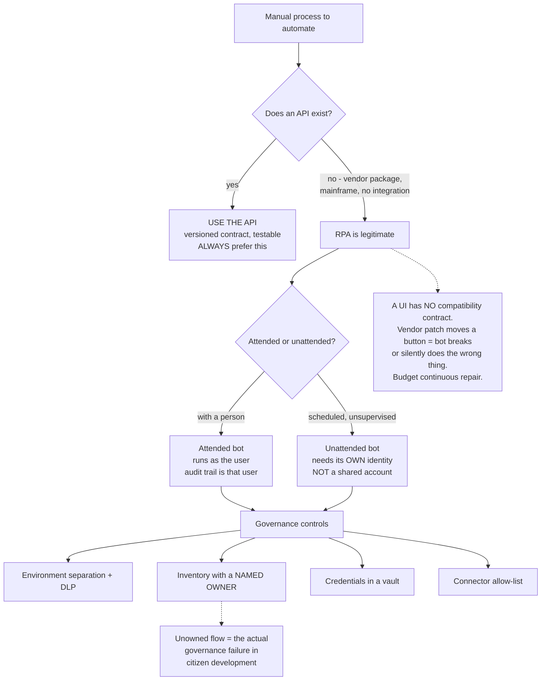

# RPA and Low-Code Governance: UiPath, Power Automate and Citizen Developer Control

**Level:** Advanced
**Tree:** [Enterprise Workflow & Process Automation](../README.md)
**Branch:** [Workflow & Process Automation](README.md)
**Forest:** [Automation & Scripting](../../../README.md)

## Explanation

## RPA is a workaround, and should be treated as one

Robotic process automation drives a **user interface** because no API exists. That is
a legitimate answer for a vendor package, a mainframe green screen or a system nobody
will ever integrate properly. **It is the wrong answer whenever an API exists**, and
choosing RPA over an available API is the most common cause of a fragile estate.

### Why RPA estates decay

A UI has no compatibility contract. A vendor patch moves a button, adds a confirmation
dialog or renames a field, and the bot fails - or worse, silently does the wrong thing.
There is no versioned interface to depend on, so **breakage is not a defect, it is the
normal condition**. Budget continuous repair and give every bot a rewrite date for when
an API becomes available.

### Attended versus unattended is an identity decision

An **attended** bot runs alongside a person, using their session and their credentials -
the audit trail is that user. An **unattended** bot runs on a schedule and needs its
**own identity**, not a shared human account. Unattended bots running as a departed
employee is a routine audit finding.

### The citizen developer problem

Power Automate puts automation in everyone hands, which is genuinely valuable and
genuinely ungovernable by default. Business-critical flows get built in personal
environments, on personal connections, by people who leave. **The control is not
prohibition** - banning it drives it underground. It is inventory, mandatory named
ownership, DLP policy per environment, a connector allow-list, and a promotion path
into a managed environment for anything that becomes important.

## Architecture and flow



## Commands

### Command 1

Inventory Power Platform environments including personal ones, which is where ungoverned flows live

```text
Get-AdminPowerAppEnvironment | Select DisplayName, EnvironmentType, CreatedBy
```

### Command 2

Enumerate active flows with their creator - the starting point for ownership attribution

```text
Get-AdminFlow | Where-Object {$_.Enabled -eq $true} | Select DisplayName, CreatedBy, LastModifiedTime
```

### Command 3

Find flows owned by departed staff, a standard audit finding and a real operational risk

```text
Get-AdminFlow | Where-Object {$_.CreatedBy.userPrincipalName -notin $activeUsers}
```

### Command 4

Review data loss prevention policies and which environments they cover - gaps here are where data leaves

```text
Get-DlpPolicy | Select DisplayName, Environments
```

### Command 5

Which connectors are actually in use, for building an evidence-based allow-list rather than a guessed one

```text
Get-AdminPowerAppConnection | Group-Object ConnectorName | Sort-Object Count -Descending
```

## Automation scripts

### Get-AutomationEstateRisk.ps1

```powershell
<#
  Inventories the low-code and RPA estate and reports governance risk.
  The findings that matter are ownership and blast radius, not flow count.
#>
[CmdletBinding()]
param(
  [int]$StaleDays = 90,
  [switch]$ExportCsv
)

$ErrorActionPreference = "Stop"
$findings = New-Object System.Collections.Generic.List[object]
function Add-Finding {
  param([string]$Severity,[string]$Area,[string]$Object,[string]$Detail)
  $findings.Add([pscustomobject]@{Severity=$Severity;Area=$Area;Object=$Object;Detail=$Detail})
}

$envs  = Get-AdminPowerAppEnvironment
$flows = Get-AdminFlow
$activeUsers = (Get-AzureADUser -All $true | Where-Object {$_.AccountEnabled}).UserPrincipalName

Write-Host ("environments: {0}   flows: {1}" -f $envs.Count, $flows.Count)
Write-Host ""

# Personal (default) environments are where ungoverned automation accumulates.
foreach ($e in $envs) {
  if ($e.EnvironmentType -eq "Default") {
    $inDefault = ($flows | Where-Object { $_.EnvironmentName -eq $e.EnvironmentName }).Count
    if ($inDefault -gt 0) {
      Add-Finding "MEDIUM" "Environment" $e.DisplayName (
        "{0} flows in the DEFAULT environment - shared by every user, weakest DLP scope" -f $inDefault)
    }
  }
}

foreach ($f in $flows) {
  $owner = $f.CreatedBy.userPrincipalName

  # An orphaned flow is the core governance failure: it runs, it touches
  # business data, and nobody can approve a change to it.
  if ($owner -and ($activeUsers -notcontains $owner)) {
    Add-Finding "HIGH" "Ownership" $f.DisplayName (
      "Owner {0} is no longer an active user - flow is orphaned but still running" -f $owner)
  }

  if (-not $f.Tags -or -not $f.Tags.owner) {
    Add-Finding "MEDIUM" "Ownership" $f.DisplayName "No owner tag - cannot attribute or review"
  }

  # Stale but enabled: still holding connections and permissions.
  if ($f.Enabled -and $f.LastModifiedTime -lt (Get-Date).AddDays(-$StaleDays)) {
    Add-Finding "LOW" "Lifecycle" $f.DisplayName (
      "Enabled but unmodified for {0}+ days - confirm it is still required" -f $StaleDays)
  }
}

# DLP coverage. An environment with no policy can move data anywhere.
$dlp = Get-DlpPolicy
foreach ($e in $envs) {
  $covered = $dlp | Where-Object { $_.Environments.name -contains $e.EnvironmentName }
  if (-not $covered) {
    Add-Finding "HIGH" "DLP" $e.DisplayName "No DLP policy applies - connectors are unrestricted"
  }
}

Write-Host ""
$order = @{"HIGH"=0;"MEDIUM"=1;"LOW"=2}
$sorted = $findings | Sort-Object { $order[$_.Severity] }, Area
$sorted | Format-Table -AutoSize -Wrap Severity, Area, Object, Detail

$hi = ($findings | Where-Object Severity -eq "HIGH").Count
Write-Host ("HIGH findings: {0}" -f $hi)

if ($ExportCsv) {
  $sorted | Export-Csv -NoTypeInformation -Path ("automation-estate-{0}.csv" -f (Get-Date -Format yyyyMMdd))
}

if ($hi -gt 0) { exit 1 }
exit 0
```

## Lab

**Objective:** Build a governed low-code estate: inventory flows, find orphaned and stale automation, apply DLP and a connector allow-list, and demonstrate the UI-fragility failure that defines RPA maintenance cost.

### Steps

1. Inventory all Power Platform environments and flows, recording which sit in the default environment.
2. Run the estate risk script and record orphaned flows, missing owner tags and DLP gaps.
3. Create a managed environment with a DLP policy and a connector allow-list.
4. Promote one business-critical flow from a personal environment into the managed one, and record what broke during the move.
5. Build a simple RPA bot that drives a web UI to extract data.
6. Confirm it works, then change the target UI - rename a field or add a confirmation dialog.
7. Observe the failure mode carefully: note whether the bot errors clearly or completes while producing wrong output.
8. Rebuild the same integration against the underlying API and compare fragility and effort.
9. Configure an unattended bot with its own service identity rather than a user account, and confirm the audit record attributes runs to the bot.
10. Produce a governance report showing coverage: flows with owners, environments with DLP, bots with dedicated identities.

### Validation

Orphaned and stale flows are identified automatically,DLP and connector allow-list apply to the managed environment,The UI change causes a demonstrable bot failure while the API integration is unaffected,Unattended runs attribute to a service identity

## Operational automation

### Governing the automation estate

- **Run the inventory on a schedule** and alert on new flows in the default environment.
  Ungoverned automation appears continuously; a one-off audit is obsolete immediately.
- **Require an owner tag** and treat an untagged flow as a finding. Ownership is the
  control that makes everything else enforceable.
- **Apply DLP per environment** with a connector allow-list built from measured usage
  rather than a guess, so the policy does not break legitimate work on day one.
- **Give unattended bots dedicated service identities** with scoped permissions, never a
  shared or personal account.
- **Track RPA bots against an API-availability register.** When a vendor ships an API,
  the bot should be scheduled for replacement rather than maintained indefinitely.

## Troubleshooting

### Scenario 1: A business-critical automation stops working and nobody knows who owns it

**Likely cause:** Flow was built by a departed employee in a personal environment with no owner tag

**Resolution:** Inventory flows against active users to find orphans, assign owners, and promote critical flows into a managed environment. Ownership must be a required attribute rather than a convention, or this recurs continuously.

### Scenario 2: An RPA bot runs successfully but produces wrong results

**Likely cause:** The target UI changed in a way that did not break the automation outright - a field moved, so the bot is reading the wrong element

**Resolution:** Add output validation to the bot rather than relying on the run status. A UI has no contract, so silent wrong output is a normal failure mode and only assertion on results catches it.

### Scenario 3: Unattended automation stops when an employee leaves

**Likely cause:** The bot runs under that persons account

**Resolution:** Move unattended automation to dedicated service identities with scoped permissions. Running production automation as a named human is both an availability risk and an audit finding.

## Interview questions

### 1. When is RPA the right choice?

When no API exists and there is no realistic path to one - a vendor package, a mainframe green screen, a system the vendor will not open up. It is a workaround for a missing integration point. Whenever an API exists, use it: an API is a versioned contract that can be tested, while a UI offers no compatibility guarantee at all.

### 2. Why do RPA estates become expensive to maintain?

Because bots depend on a user interface, and a UI has no compatibility contract. Any vendor patch that moves a control, renames a field or adds a dialog can break the bot - or worse, let it complete while producing wrong output. Breakage is the normal condition rather than a defect, so continuous repair must be budgeted from the start.

### 3. How do you govern citizen development without banning it?

Inventory, mandatory named ownership, DLP policy per environment, a connector allow-list built from actual usage, and a promotion path into a managed environment for anything that becomes business-critical. Prohibition drives it underground into personal accounts, which is strictly worse - the automation still exists and is now invisible.

### 4. What is the difference between attended and unattended automation from a security view?

Attended automation runs in a persons session with their credentials, so the audit trail is that user and permissions are already scoped. Unattended automation runs unsupervised and needs its own service identity with its own scoped permissions. Running unattended bots under a human account is common and creates both an availability risk when that person leaves and an accountability gap when something goes wrong.

## Certification alignment

- UiPath Certified RPA Associate / Advanced Developer
- Microsoft PL-500: Power Automate RPA Developer
- Microsoft PL-600: Power Platform Solution Architect - environment strategy and DLP

## References

- Microsoft Power Platform admin documentation: environments, DLP policies and tenant governance
- UiPath documentation: attended versus unattended robots and Orchestrator credential handling
- Industry guidance on RPA total cost of ownership and UI-fragility maintenance

## Suggested video search

UiPath Power Automate RPA governance citizen developer DLP unattended bot identity

---

> Validate commands, versions, permissions, licensing, and rollback procedures in an isolated lab before production use.
