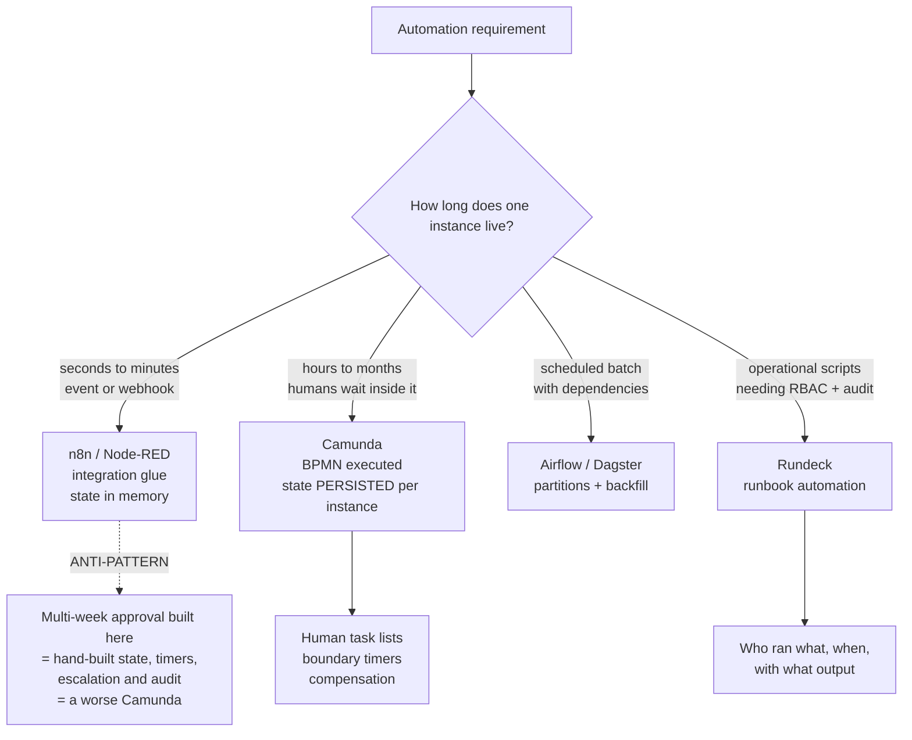

# Workflow Engine Selection: n8n, Camunda, Airflow, Node-RED and Rundeck

**Level:** Advanced
**Tree:** [Enterprise Workflow & Process Automation](../README.md)
**Branch:** [Workflow & Process Automation](README.md)
**Forest:** [Automation & Scripting](../../../README.md)

## Explanation

## Choose by workflow lifetime, not by feature list

Every one of these tools draws boxes and arrows, which makes feature comparisons
useless. **The question that decides the answer is how long a single workflow instance
lives, and whether a human waits inside it.**

### Short-lived, event-triggered

**n8n** and **Node-RED** connect systems. An event or webhook arrives, a few API calls
run, it finishes in seconds. State lives in memory; a retry restarts from the
beginning. n8n is strongest on SaaS integration and is self-hostable, which is usually
why it wins over cloud-only iPaaS. Node-RED is flow-based and MQTT-native, so it
dominates edge and OT work.

### Long-running with human tasks

**Camunda** executes BPMN rather than merely rendering it. A process instance persists
its token position and variables, so it can wait days for an approval, escalate on a
timer, and compensate completed steps when a later one fails. **An integration tool
cannot do this** - it has nowhere to keep the state.

### Scheduled data pipelines

**Airflow** and Dagster treat time and dependency as first-class: partitions, backfill,
retries. Human tasks are not part of the model.

### Operational runbooks

**Rundeck** is the one most often missing from comparisons and solves a real problem:
engineers running privileged scripts from their laptops. Wrapping those in a job with
RBAC, constrained parameters and a recorded output turns tribal operations into
auditable self-service.

### The expensive mistake

Building a multi-week approval process in an integration tool because it was already
installed. You then hand-build state persistence, timers, escalation and an audit
trail - producing a worse Camunda maintained by one person who will eventually leave.

## Architecture and flow



## Commands

### Command 1

Run n8n self-hosted with a persistent volume - the credential store lives there and must survive restarts

```text
docker run -d --name n8n -p 5678:5678 -v n8n_data:/home/node/.n8n n8nio/n8n
```

### Command 2

Trigger an n8n webhook workflow - the standard integration entry point

```text
curl -X POST http://localhost:5678/webhook/<path> -H "Content-Type: application/json" -d @payload.json
```

### Command 3

Start a Camunda process instance via REST, which is how an application hands work to the engine

```text
curl -u demo:demo -X POST http://localhost:8080/engine-rest/process-definition/key/<key>/start -H "Content-Type: application/json" -d "{}"
```

### Command 4

List a users pending Camunda tasks - the human-task inbox that distinguishes a process engine

```text
curl -u demo:demo http://localhost:8080/engine-rest/task?assignee=<user>
```

### Command 5

List Rundeck jobs in a project - the catalogue of approved operational actions

```text
rd jobs list -p <project>
```

### Command 6

Execute a Rundeck job with parameters, producing an audited run record

```text
rd run -p <project> -j <job> -- -env prod
```

## Automation scripts

### workflow-engine-fit-check.sh

```bash
#!/usr/bin/env bash
# Scores a candidate automation requirement against engine characteristics.
# Answers are the INPUT - the point is to force the questions to be asked.
set -euo pipefail

ask() { printf "%s [y/n]: " "$1"; read -r a; [ "${a}" = "y" ]; }

echo "Workflow engine fit check"
echo

LONG=0; HUMAN=0; SCHED=0; OPS=0; EDGE=0

ask "Does a single instance live longer than one hour?" && LONG=1
ask "Does a HUMAN make a decision inside the flow?" && HUMAN=1
ask "Is it triggered by a SCHEDULE with data dependencies?" && SCHED=1
ask "Is it operators running privileged scripts?" && OPS=1
ask "Is it edge, IoT or MQTT device wiring?" && EDGE=1
echo

# Long-running + human is the decisive combination. Nothing else
# persists per-instance state with task lists and timers.
if [ "${LONG}" -eq 1 ] && [ "${HUMAN}" -eq 1 ]; then
  echo "RECOMMENDATION: Camunda (BPMN process engine)"
  echo "  Long-running WITH human tasks requires durable per-instance state,"
  echo "  task lists, escalation timers and compensation. Building this on an"
  echo "  integration tool means re-implementing a process engine badly."
  exit 0
fi

if [ "${SCHED}" -eq 1 ]; then
  echo "RECOMMENDATION: Airflow or Dagster"
  echo "  Time and dependency are first-class; backfill and partitioning are"
  echo "  built in. Note: human approval steps are NOT part of the model."
  exit 0
fi

if [ "${OPS}" -eq 1 ]; then
  echo "RECOMMENDATION: Rundeck"
  echo "  Wraps privileged scripts in RBAC, constrained parameters and an"
  echo "  audited run record. Replaces engineers running scripts from laptops."
  exit 0
fi

if [ "${EDGE}" -eq 1 ]; then
  echo "RECOMMENDATION: Node-RED"
  echo "  Flow-based and MQTT-native; strongest at edge and OT."
  exit 0
fi

echo "RECOMMENDATION: n8n"
echo "  Short-lived SaaS/API integration. Self-hostable, which matters when"
echo "  the data cannot go to a cloud-only iPaaS."
echo
if [ "${LONG}" -eq 1 ]; then
  echo "  WARNING you answered long-running but with no human step."
  echo "  Verify the instance state can genuinely be rebuilt on retry -"
  echo "  if it cannot, you need a process engine after all."
fi
```

## Lab

**Objective:** Implement the same approval requirement in both n8n and Camunda, then prove the difference by restarting each mid-flight while an approval is pending.

### Steps

1. Define a requirement: a purchase request over a threshold needs manager approval, escalating after 48 hours, then reserves funds and dispatches.
2. Build it in n8n using a webhook trigger, a wait node and API calls.
3. Build the same process in Camunda as BPMN with a user task, a boundary timer and service tasks.
4. Start ten instances in each and leave them pending approval.
5. Restart both engines.
6. Confirm Camunda instances resume with their token position and variables intact.
7. Observe what happens to the n8n executions and record it honestly.
8. Add an escalation requirement at 48 hours to both and compare the implementation effort.
9. Add compensation - release reserved funds if dispatch fails - to both and compare again.
10. Wrap a privileged operational script in a Rundeck job with RBAC and parameters, and confirm the run record shows who ran it with what input.

### Validation

Camunda instances survive restart with state intact,The effort to add escalation and compensation is materially lower in Camunda,The Rundeck job produces an audit record identifying user, parameters and output

## Operational automation

### Operating workflow engines

- **Version workflow definitions in Git.** n8n workflows and Camunda BPMN are both
  exportable; a workflow edited only in a UI has no review, no history and no rollback.
- **Never store credentials in the workflow definition.** Use the engine credential
  store backed by a vault, so an exported definition is safe to commit.
- **Deploy BPMN through CI**, treating a process definition as a versioned artefact.
  Camunda supports versioned deployment with migration of running instances - which is
  necessary because instances started under the old version are still live.
- **Monitor incident counts, not just job success.** A process engine parks failed
  instances as incidents; they accumulate quietly and nothing alerts by default.
- **Put Rundeck in front of privileged scripts** rather than trying to stop engineers
  running them. The goal is an audited path that is easier than the unaudited one.

## Troubleshooting

### Scenario 1: Long-running integration flows lose state on restart or redeploy

**Likely cause:** The workflow is running on an integration tool that keeps execution state in memory

**Resolution:** For genuinely long-running processes, move to a process engine with durable per-instance state. If that is not possible, make every step idempotent and externalise state to a database - which is re-implementing a process engine, and should be a conscious decision rather than a drift.

### Scenario 2: Camunda accumulates thousands of incidents nobody noticed

**Likely cause:** Failed service tasks are parked as incidents by design, and nothing alerts on the count

**Resolution:** Alert on incident count and age. An incident is a stuck process instance - each represents a real business item not progressing, and the business usually notices before the platform does.

### Scenario 3: Nobody can say which workflows exist or who owns them

**Likely cause:** Workflows built directly in the UI with no export, no repository and no ownership record

**Resolution:** Export definitions to Git, require an owner tag on every workflow, and audit for unowned ones. This is the same governance failure as citizen-developed low-code and has the same remedy.

## Interview questions

### 1. How do you choose between n8n and Camunda?

By how long an instance lives and whether a human waits inside it. n8n is for short-lived integration - an event arrives, some API calls run, it completes in seconds with state in memory. Camunda is for long-running processes where an instance may wait days for an approval, needs escalation timers and compensation, and must survive restarts. They are not competing products; they solve different problems.

### 2. What goes wrong when a long-running process is built on an integration tool?

You end up re-implementing a process engine. Durable per-instance state, human task lists, escalation timers, compensation for completed steps and an audit trail all have to be hand-built. The result works, is understood by one person, and becomes unmaintainable when they leave. The tooling choice is usually made because the integration tool was already installed rather than because it fits.

### 3. Why does Rundeck exist when everyone has Ansible?

They solve different halves. Ansible defines what a task does. Rundeck governs who may run it, with which parameters, and records the result. The problem it addresses is engineers executing privileged scripts from their laptops with no RBAC and no audit trail. Wrapping those scripts in jobs turns tribal operations into auditable self-service without changing the scripts.

### 4. What is compensation in BPMN and why does it need engine support?

Compensation undoes steps that already completed successfully, in reverse order, when a later step fails - releasing reserved funds after a dispatch failure, for example. It is not error handling, because the earlier steps did not fail. It needs engine support because only the engine knows which steps in this particular instance completed and therefore what must be undone.

## Certification alignment

- Camunda Certified Developer / Architect - BPMN execution and process engine operations
- Astronomer Certified Apache Airflow DevOps - scheduling and orchestration
- ITIL 4 - workflow, request fulfilment and service request management

## References

- Camunda documentation: BPMN execution semantics, timers and compensation
- n8n documentation: self-hosting, credential store and workflow versioning
- Rundeck documentation: job definitions, ACL policy and execution audit

## Suggested video search

n8n Camunda Airflow Node-RED Rundeck workflow engine comparison BPMN orchestration

---

> Validate commands, versions, permissions, licensing, and rollback procedures in an isolated lab before production use.
